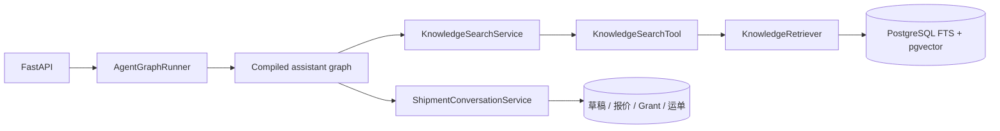

# Agent 与 RAG 架构

`agent/workflow/assistant_graph.py` 是唯一图构建入口。`workflow/nodes/` 只放 LangGraph 节点和路由；`capabilities/` 放节点调用的确定性业务服务；`runtime/` 负责依赖注入、`Command(resume=...)` 选择和公开 SSE 映射。不存在 `Port`、`Adapter`、寄件子图或第二个 ReAct 循环。

## 在线检索

模型仅能调用 `search_knowledge`。`assistant_tools_node` 校验参数后调用 `KnowledgeSearchService.search()`，再进入既有 `KnowledgeSearchTool` 和 `KnowledgeRetriever`。检索返回的证据被序列化为 `role=tool` 消息，下一次 `assistant_agent_node` 调用模型时连同系统提示词和对话历史一起传入，因此最终回答由模型基于证据生成，而不是检索工具直接生成。

## 离线索引与在线召回

离线解析、切片、向量化、审核发布仍属于独立 `knowledge/` 模块。在线阶段结合 PostgreSQL 全文索引与 pgvector 向量检索得到候选知识块，服务只向 Agent 暴露已发布、生效的证据及引用元数据。LangGraph 编排调用时机，不复制或替代 RAG 实现。

## 状态边界

`AssistantState` 保存消息、工具循环计数、寄件进度、报价进度、确认快照、回复和错误。身份、数据库 Session、模型与业务服务位于 `AgentRuntimeContext`，不会写进 checkpoint。短期对话消息和寄件业务事实在 PostgreSQL；checkpoint 只恢复图执行位置和中断状态。当前没有 MCP、Deep Agents、GraphRAG 或自动物流异常处置。
