# Agent 与 RAG 模块细粒度讲解

> 本文面向研发同学，从代码级粒度拆解 `backend/src/yitu/agent` 与 `backend/src/yitu/knowledge` 两个模块。
> 每个小节都给出「实现位置 → 数据结构/关键常量 → 流程」，并尽量用 Mermaid 图表达。
> 更偏「业务白话」的版本见根目录 `overview.md`；本文与之互补，侧重真实代码与流程图的对应关系。

---

## 0. 项目结构总览

```
yitu/
├── backend/                     # FastAPI + SQLAlchemy(async) + Celery + LangGraph
│   ├── src/yitu/
│   │   ├── agent/               # ★ 本文重点：AI 对话编排与受控写操作
│   │   ├── knowledge/           # ★ 本文重点：生产 RAG（摄入 + 检索）
│   │   ├── shipments/           # 运单领域（状态机、轨迹、应用服务）
│   │   ├── addresses/           # 地址簿（查重、归一化）
│   │   ├── pricing/             # 计价（报价快照、规则版本）
│   │   ├── dispatch/            # 派单/任务
│   │   ├── identity/            # 身份与角色（JWT、权限四层校验）
│   │   ├── platform/            # 配置、数据库、幂等、审计、Outbox、错误协议
│   │   └── ...                  # sla / tracking / labels / payments / returns 等
│   ├── migrations/versions/     # Alembic 迁移
│   ├── evals/cases/             # 固定评测集（Agent 离线评测）
│   ├── scripts/                 # 冒烟/脏数据清理脚本
│   └── tests/                   # 各领域专项测试
├── frontend/                    # Vue3 + Vite + Element Plus（阶段六冻结 API 后开发）
├── docs/                        # 文档（本文 + agent.md + knowledge-rag.md + 业务规则 + PRD + 计划）
├── overview.md                  # 全项目白话讲解
└── compose.yaml                 # Docker Compose（API + Worker + PostgreSQL + Redis 等）
```

两个模块在系统中的位置（Agent 依赖 RAG，两者不反向耦合）：

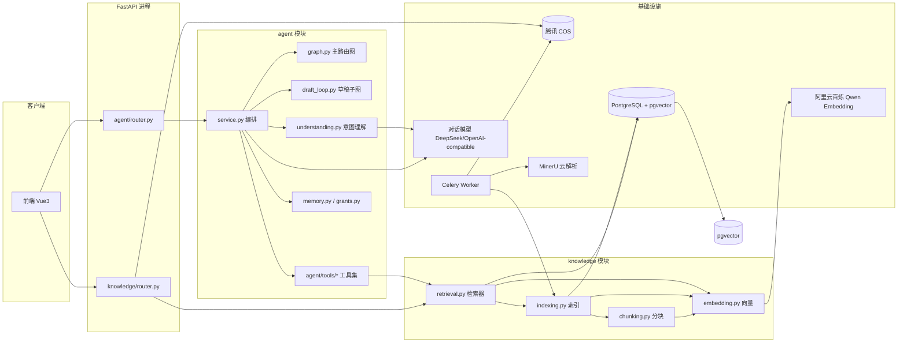

---

# 第一部分 · Agent 模块

## 1. 目录清单与职责

| 文件 | 职责 |
|------|------|
| `graph.py` | 装配**主路由图**（10 节点），只做安全路由，不调模型 |
| `draft_loop.py` | 装配**草稿填写子图**（agentic loop，模型 ⇄ 工具） |
| `nodes.py` | 主图节点的确定性实现 + 两道正则安全拦截 |
| `state.py` | `AgentState`（TypedDict），图执行共享状态 |
| `service.py` | `AgentConversationService`：单轮编排 `_run_turn`，把「图」与「业务」串起来 |
| `understanding.py` | 意图理解（Fast Path 正则 + Slow Path LLM） |
| `context.py` | `build_model_context` 上下文组装 + 截断 + 二次脱敏 |
| `model_adapter.py` | `ModelAdapter` Protocol + 固定/生产两个实现 |
| `models.py` | 5 张表：会话、消息、草稿、授权、记忆 |
| `drafts.py` | 草稿持久化、校验、报价前置（`DraftService`） |
| `grants.py` | HITL 一次性授权（签发/消费） |
| `memory.py` | 长期/语义记忆（增删查 + 语义召回） |
| `checkpoint_store.py` | LangGraph checkpointer 生命周期（memory / postgres 切换） |
| `privacy.py` | `redact_text` 脱敏 + 禁项检测 |
| `prompts.py` | 系统提示词、拒绝话术、知识解答/草稿 loop 专用提示词 |
| `rag_enhancements.py` | RAG 的 LLM 查询改写器 + 精排器（agent 持有 AI 实现） |
| `write_tools.py` | `AgentWriteService`：授权消费 + 创建运单同事务 |
| `schemas.py` / `sse.py` / `tracing.py` | 请求模型 / SSE 事件编码 / 追踪 |
| `tools/base.py` | `ToolContext`、`ToolResult` 统一契约 |
| `tools/*.py` | 只读工具：`knowledge` / `shipments` / `identity`；写工具：`drafts` |

## 2. 核心设计原则

1. **AI 是助手，不是决策者**：金额、权限、状态、SLA 一律由确定性业务服务裁决；AI 只做解释、建议和**受控**写操作。
2. **主图不碰模型，子图才碰模型**：主路由图（`graph.py`）纯确定性，只做安全检查 + 路由；唯一有模型自主循环的是草稿子图。
3. **两条入口共用同一服务**：AI 对话下单和表单下单最终都走 `ShipmentApplicationService.create`，不复制业务规则。
4. **纵深防御**：安全拦截在图外 `_run_turn` 和图内 `classify_intent_node` 各做一次。

## 3. 数据模型（5 张表）

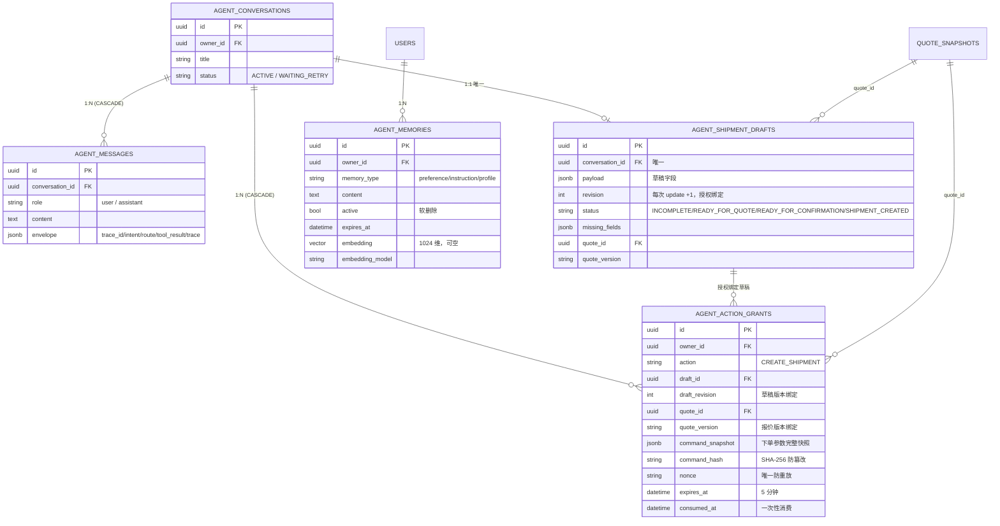

## 4. 一次对话的完整生命周期

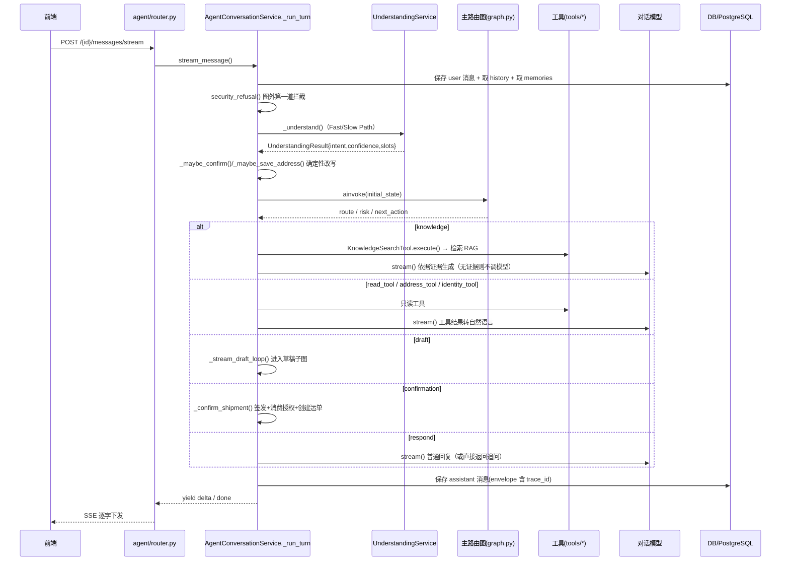

## 5. 主路由图（`graph.py`）

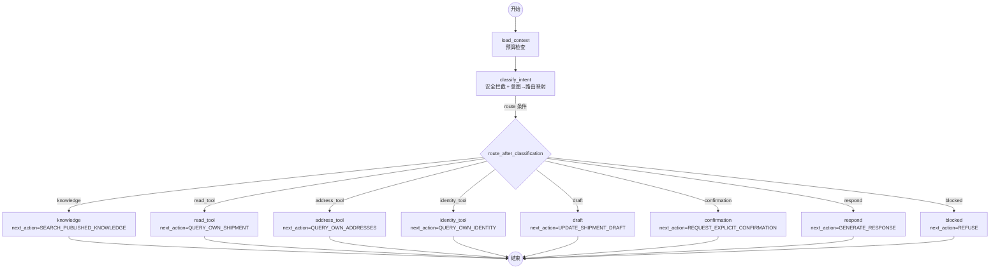

要点：

- 10 个节点 = `load_context` + `classify_intent` + 8 个终端节点。
- 终端节点**只产出 `next_action`**，不真正执行检索/查询；真正的工具调用在图跑完后由 `_run_turn` 按 `route` 分发执行。
- 条件边 `route_after_classification` 只读 `state["route"]`，未知值一律落到 `blocked`（默认拒绝）。

### 5.1 意图 → 路由映射（`nodes.py`）

| 意图 `AgentIntent` | 风险 `AgentRisk` | 路由 `AgentRoute` |
|---|---|---|
| `GENERAL_CHAT` | `LOW` | `respond` |
| `KNOWLEDGE_QUERY` | `LOW` | `knowledge` |
| `SHIPMENT_QUERY` | `PERSONAL_DATA` | `read_tool` |
| `DRAFT_UPDATE` | `WRITE_ACTION` | `draft` |
| `SENSITIVE_ACTION` | `WRITE_ACTION` | `confirmation` |
| `ADDRESS_QUERY` | `PERSONAL_DATA` | `address_tool` |
| `IDENTITY_QUERY` | `PERSONAL_DATA` | `identity_tool` |

特殊分支：`requires_confirmation == True` 或意图本身是 `SENSITIVE_ACTION` 时，无论识别结果如何，都强制路由到 `confirmation`。

## 6. 意图理解（`understanding.py`）

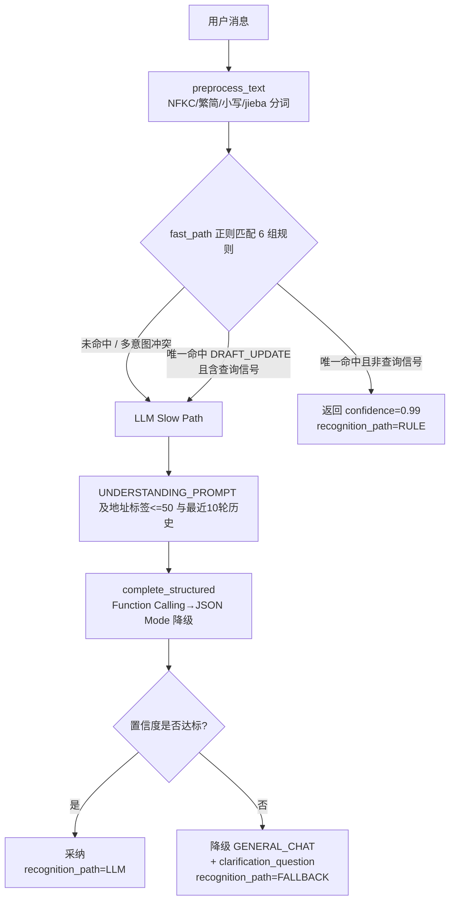

Fast Path 的 6 组规则（`_FAST_PATH_RULES`）：

1. `SHIPMENT_QUERY`：查/看/问 + 运单/快递/包裹 + 状态/进度/轨迹；或 `yt` 单号 + 查询词。
2. `KNOWLEDGE_QUERY`：禁寄/限寄/能不能寄；包装/保价/赔付 + 规则/要求。
3. `DRAFT_UPDATE`：从 X 寄到 Y；重量 + 数字 + 单位；尺寸 `长x宽x高`。
4. `SENSITIVE_ACTION`：确认/立即/帮我 + 下单/创建运单/支付/退款/取消。
5. `ADDRESS_QUERY`：我的/看看/有哪些 + 地址；地址簿。
6. `IDENTITY_QUERY`：我是谁 / 我的账号/身份/角色/网点。

关键保护规则：只命中 `DRAFT_UPDATE` 但句子含「查/看/多少钱/多久」等查询信号（`_QUERY_SIGNAL`）时，放弃 Fast Path 交给 LLM，避免「查一下从北京寄到上海的运单」被误判为填草稿。

两个确定性改写（在 `service.py` 中，位于图执行前）：

- `_maybe_confirm`：草稿已报价待确认（`READY_FOR_CONFIRMATION`）且整句为确认词（`是/好的/确认/下单/可以…`）时，改写为 `SENSITIVE_ACTION`。
- `_maybe_save_address`：下单后待保存临时地址且整句为保存确认时，确定性把临时地址转正。

## 7. 草稿填写子图（`draft_loop.py`）

这是唯一的 **agentic loop**（模型自主循环）：

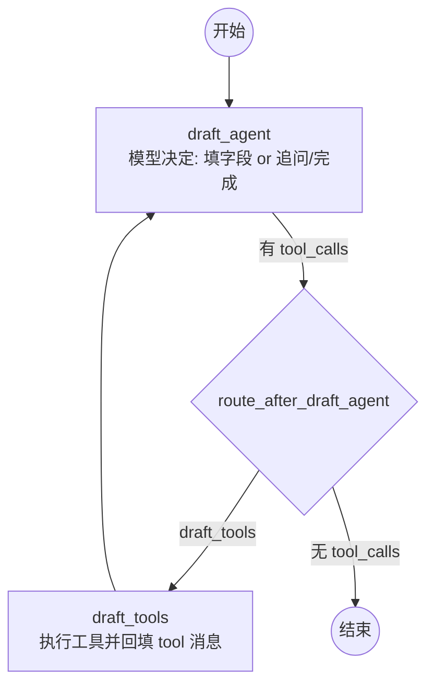

- 工具**白名单**只有两个：`update_draft`（填字段）和 `save_address`（口述地址落库为临时地址）。
- 工厂函数 + 闭包注入依赖（`model` / `session` / `actor` / `addresses` / `stream_queue`），业务对象不进图状态。
- `draft_turns` 用 `Annotated[list, add]` 累积（`state.py`），每轮追加而非覆盖。

`update_draft` 的落库规则（`tools/drafts.py`）：

- 地址只接受**地址簿中唯一匹配的标签**（`_match_address_label`，多匹配即拒绝，绝不模糊选）。
- 标签命中后回填 `sender_address_id` + `origin_district_code`（或收件侧）。
- `save_address` 先按归一化五元组（用户/姓名/电话/区县/门牌）查重，命中复用，否则建 `ephemeral=True` 临时地址；解析省市区名称由 `resolve_region_by_names` 完成。

草稿状态机（`drafts.py`）：

```mermaid
stateDiagram-v2
    [*] --> INCOMPLETE
    INCOMPLETE --> READY_FOR_QUOTE : update 后 missing_fields 为空
    READY_FOR_QUOTE --> INCOMPLETE : 再次 update 引入缺失字段
    READY_FOR_QUOTE --> READY_FOR_CONFIRMATION : validate_and_quote 成功
    READY_FOR_CONFIRMATION --> SHIPMENT_CREATED : 授权消费创建运单
```

`validate_and_quote` 调用正式 `PricingService.quote`，报价绑定 `quote_id` + `quote_version`，供后续授权校验使用（幂等键 `agent-draft:{id}:revision:{rev}:quote`）。

## 8. HITL 人工确认（`grants.py`）

项目**不用** LangGraph 的 `interrupt()`，而是自研一次性授权令牌 `AgentActionGrant`。

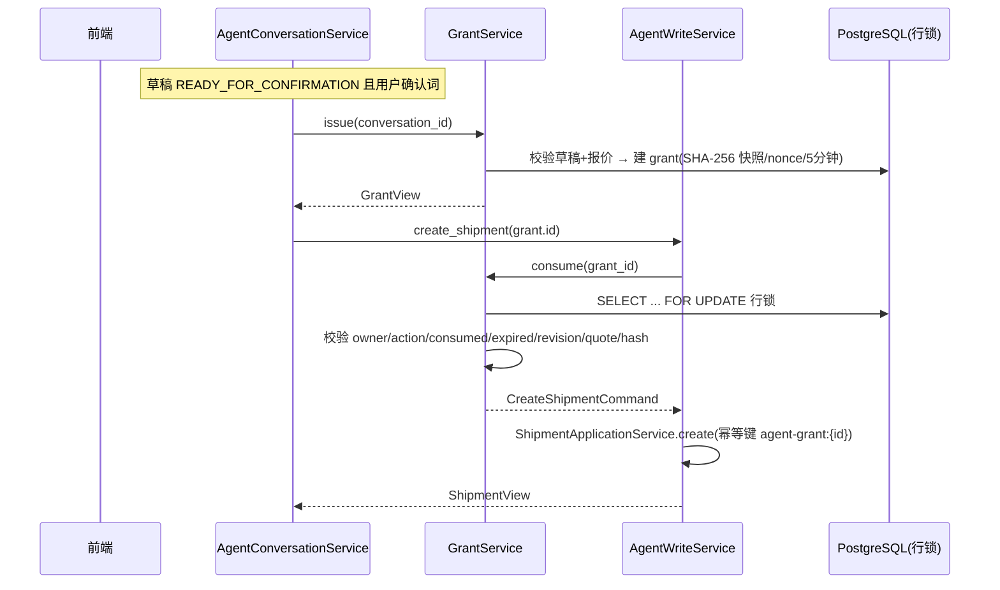

消费校验清单（任一失败即审计并拒绝）：

| 校验项 | 失败码 |
|---|---|
| 非本人 | `403 FORBIDDEN_RESOURCE_OWNER` |
| 动作非法 | `409 AGENT_GRANT_ACTION_INVALID` |
| 已消费 | `409 AGENT_GRANT_CONSUMED` |
| 已过期 | `409 AGENT_GRANT_EXPIRED` |
| 草稿版本变化 | `409 AGENT_GRANT_DRAFT_CHANGED` |
| 报价变化 | `409 AGENT_GRANT_QUOTE_CHANGED` |
| 快照被篡改 | `409 AGENT_GRANT_SNAPSHOT_INVALID` |

安全保障：5 分钟短时效、一次性消费、草稿/报价版本绑定、`command_hash = canonical_json_sha256(snapshot)` 防篡改、`SELECT ... FOR UPDATE` 行锁防并发、幂等键防重放、全量审计。

## 9. 上下文组装与隐私（`context.py` + `privacy.py`）

`build_model_context(history, memories, tool_results)` 组装顺序（固定）：

1. `SYSTEM_PROMPT`（平台身份与行为边界，永远第一条）
2. `用户偏好：xxx；yyy`（记忆 ≤10 条）
3. `工具执行结果：…`（每个 ≤8000 字符，在 JSON 闭合边界处截断）
4. 历史消息（最近 20 轮，每条 ≤8000 字符）

全量过 `redact_text()` 二次脱敏：隐藏 `sk-`/`AKID` 密钥、JWT 令牌、11 位手机号、邮箱。

`contains_forbidden_memory()` 用于拒绝把密钥/令牌/联系方式写入长期记忆。

## 10. 模型适配器（`model_adapter.py`）

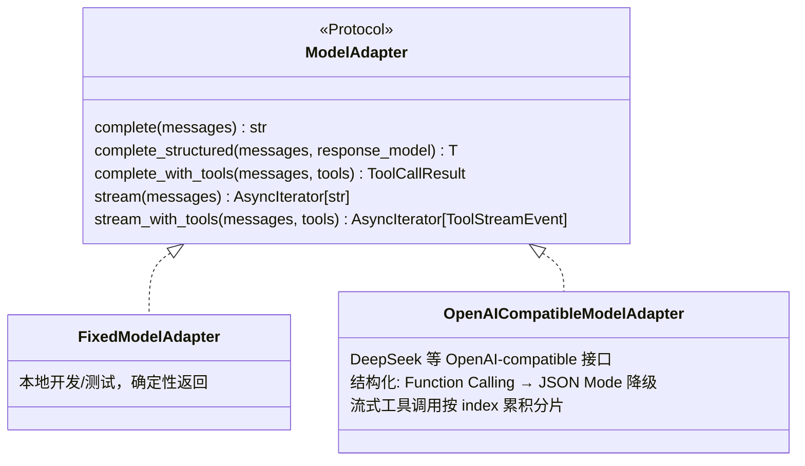

`get_model_adapter()` 依据 `agent_model_provider` 选择 `fixed` / `openai-compatible` / `deepseek`。

## 11. 记忆系统（4 种）

| 记忆 | 存储 | 用途 | 实现位置 |
|---|---|---|---|
| 短期（会话消息） | `agent_messages` | 普通回复取 20 轮、草稿/理解取 10 轮 | `models.py` |
| 工作（草稿 loop 中间态） | LangGraph checkpointer | 草稿子图 `draft_turns` 持久化 | `checkpoint_store.py` |
| 长期（用户偏好） | `agent_memories` | 显式确认 + 脱敏 + 禁项过滤 | `memory.py` |
| 语义（按意思召回） | `agent_memories.embedding` | 余弦相似度召回，失败降级 recency | `memory.py` |

Checkpointer 后端切换（`checkpoint_store.py`）：

- `memory`（`MemorySaver`）：开发/测试，进程内，重启丢失。
- `postgres`（`AsyncPostgresSaver`）：生产/多副本，共享 PG，连接池 1~10，懒初始化 + 异步锁双检，`setup()` 幂等建表。
- `thread_id = conversation_id`；每轮草稿 loop 前 `_clear_thread()` 清空上一轮状态，避免 `add` reducer 累积。

语义记忆召回（`MemoryService.recall`）：

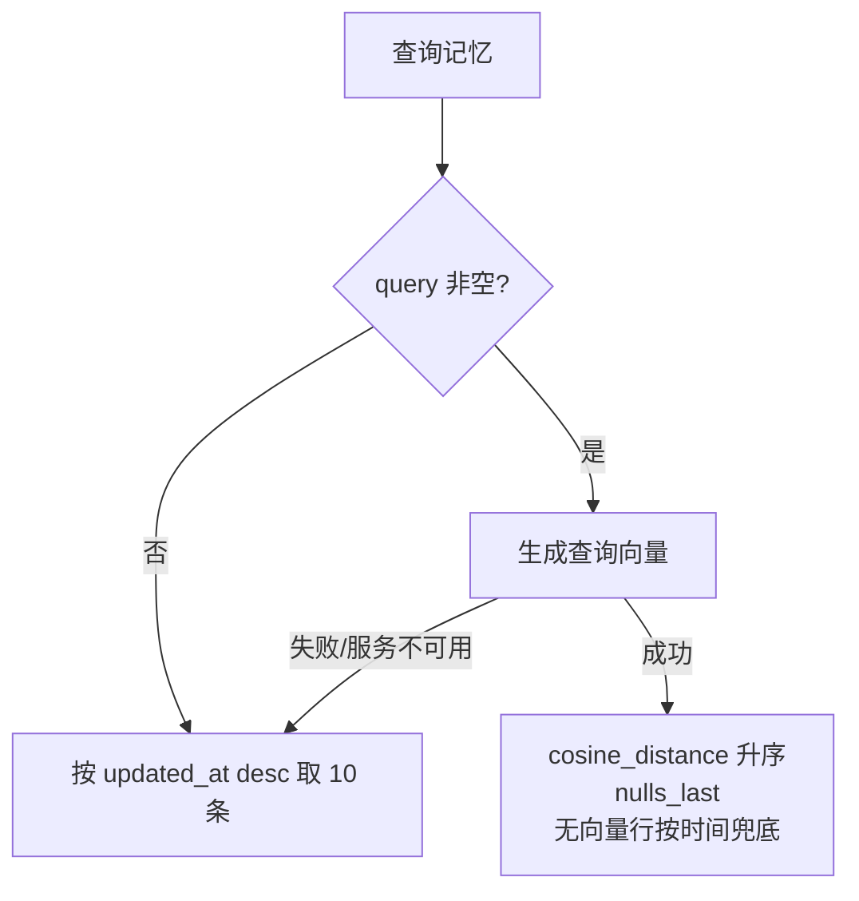

写入时向量生成失败**不阻塞**记忆创建（`embedding=NULL` 降级），复用 `knowledge.embedding.get_embedding_provider`。

## 12. 流式输出机制

- 普通回复/工具回复：直接 `model.stream()`，每个增量 `yield ("delta", chunk)`，由 SSE 转发。
- 草稿子图：LangGraph 节点无法向外传数据，用 `asyncio.Queue` 桥接——`draft_agent_node` 在 `stream_with_tools` 里把每个 `delta` `put` 进队列，外层 `_stream_draft_loop` 并发 `get` 并 `yield`；图任务结束 `put(None)` 作为完成信号。

## 13. 执行预算与安全边界

预算常量（`service.py` 初始状态）：

- `max_turns = 8`、`max_tool_calls = 4`、`timeout_seconds = 30.0`。

安全拦截（`nodes.py`）两道正则：

- 提示注入：`忽略…指令`、`显示系统提示词`、`绕过权限`、`you are now` 等 → `INJECTION_REFUSAL` → `blocked`。
- 跨用户查询：`查别人的运单`、`查询其他用户` 等 → `CROSS_USER_REFUSAL` → `blocked`。

拒绝时**不向模型暴露内部匹配规则**，只输出固定话术。

---

# 第二部分 · RAG 模块

## 1. 目录清单与职责

| 文件 | 职责 |
|------|------|
| `models.py` | `KnowledgeDocument` / `KnowledgeChunk` 两表 + `DocumentStatus` 枚举 |
| `state_machine.py` | 文档状态转移白名单 + `resume_parsing` |
| `service.py` | 上传校验（PDF 魔数/加密/大小/SHA-256 去重）+ 删除 |
| `lifecycle.py` | 审核/发布/归档/停用/重新解析（`change_document_status`） |
| `router.py` | 管理与检索 REST API |
| `tasks.py` | Celery 任务链：`submit_mineru_document` / `poll_mineru_document` |
| `mineru_client.py` | MinerU v4 异步解析客户端（提交/轮询/下载） |
| `blob_store.py` | 对象存储抽象（本地 FS / 腾讯 COS S3） |
| `artifacts.py` | MinerU ZIP 产物安全检查与解压 |
| `parsers.py` | `MinerUParser` + `PyMuPDFParser`（降级） |
| `chunking.py` | `ChunkingPolicy` 结构化分块 |
| `tokenization.py` | jieba 分词（索引侧 / 查询侧 / 枚举增强） |
| `embedding.py` | `QwenEmbeddingProvider` / `DeterministicEmbedding` |
| `indexing.py` | `build_index_version` 双路索引构建 |
| `retrieval.py` | `KnowledgeRetriever` 混合检索 + 融合 + 精排 |
| `schemas.py` / `retrieval_schemas.py` | 请求/响应/证据视图 |
| `evaluation.py` | 检索评测 |

## 2. 数据模型与状态机

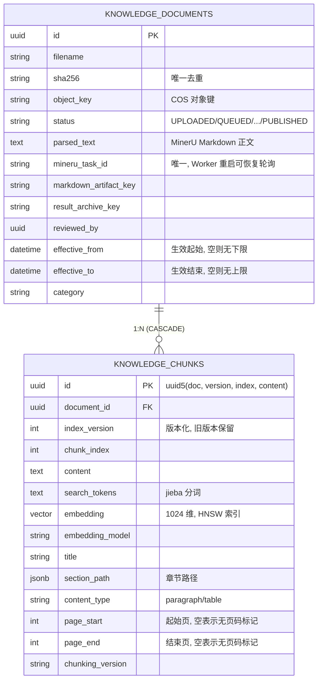

文档生命周期状态机（`state_machine.py`）：

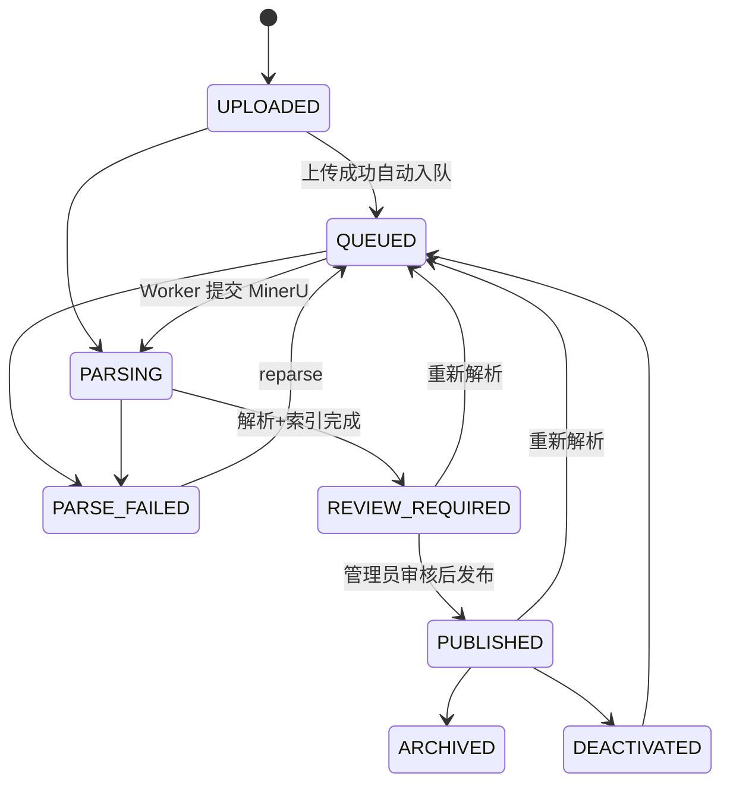

只有 `PUBLISHED` 且处于生效时间范围内的文档参与检索。

## 3. 阶段一：摄入 / 索引管道

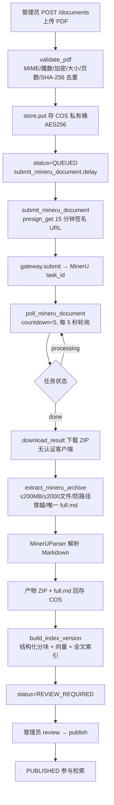

错误二分处理（`mineru_client.py` / `tasks.py`）：

- 临时性（429 / 5xx / 网络）→ `MinerURetryableError` → Celery 退避重试（提交 8 次、轮询 60 次，backoff 上限 300s）。
- 永久性（4xx / 配置错误 / 响应非法）→ `MinerUPermanentError` → 标记 `PARSE_FAILED`，不重试。
- 幂等提交：`PARSING` 且已有 `mineru_task_id` 时重复投递只恢复轮询，不重复计费。

### 3.1 结构化分块（`chunking.py`）

`ChunkingPolicy(max_chars=800, overlap=100)`：

```mermaid
flowchart TD
    A[Markdown 正文] --> B[逐行扫描]
    B --> C{行类型}
    C -->|页码标记 page: N| D[记录 current_page]
    C -->|标题 #~######| E[维护 headings 章节栈<br/>flush 上一个块]
    C -->|表格 &#124;...&#124;| F[标记 block_type=table<br/>表格整体不拆]
    C -->|空行| G[flush]
    C -->|普通行| H[累积 pending]
    H --> I{块长度是否超限?}
    I -->|否| J[保持完整]
    I -->|是| K[优先在句号/换行处<br/>重叠 100 字切分]
    D --> B
    E --> B
    F --> H
    G --> B
    J --> L[TextChunk 含 title/section_path/content_type/page]
    K --> L
```

每块携带：序号、内容、当前章节标题、完整章节路径、内容类型（段落/表格）、页码范围。

### 3.2 双路索引（`indexing.py` + `embedding.py` + `tokenization.py`）

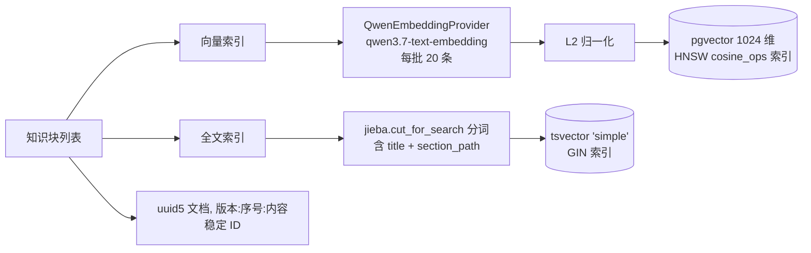

- 稳定 ID：`uuid5(document.id, f"{version}:{index}:{content}")`，重建同版本不产生重复身份。
- 版本化：`build_index_version` 每次新建 `version = latest + 1`，旧版本保留，检索只读最新版本，支持原子切换。
- 维度强约束：数据库 `CHECK (embedding_dimension = 1024)`，换模型必须先探测维度。

## 4. 阶段二：检索管道（`retrieval.py`）

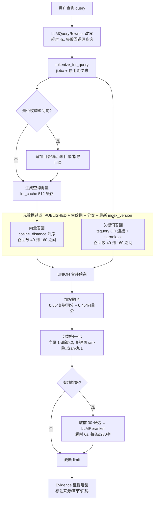

权重常量（`retrieval.py`）：

- `KEYWORD_WEIGHT = 0.55`、`VECTOR_WEIGHT = 0.45`。
- 向量分归一化 `1 - (cosine_distance / 2)`（距离 0→1.0，距离 2→0.0）。
- 关键词分归一化 `ts_rank_cd / (ts_rank_cd + 1)`。
- 候选池 `candidate_limit = clamp(limit * 8, 40, 160)`；精排池 `RERANK_POOL_SIZE = 30`。

### 4.1 查询改写 / 精排的架构解耦

- `knowledge/retrieval.py` 只定义 `QueryRewriter` / `Reranker` 两个 Protocol（接口）。
- `agent/rag_enhancements.py` 提供 `LLMQueryRewriter` / `LLMReranker` 的 AI 实现。
- `build_rag_enhancements()` 生产模型可用时返回改写器+精排器，固定模型/未配置返回 `(None, None)`，自动退回纯融合排序。
- 两者失败/超时一律回退原始输入，**绝不阻塞检索主链路**。

## 5. 证据组装与引用格式

`Evidence`（`retrieval.py`）→ `KnowledgeCitation`（`tools/knowledge.py`）→ 文本块（`service.py::_format_knowledge_evidence`）：

```
【证据 1】《禁限寄物品目录》 禁寄物品（第3章/第12页）
内容……

【证据 2】《包装规范》 易碎品包装要求（第5页）
内容……
```

证据块注入时前置 `KNOWLEDGE_ANSWER_PROMPT`（只依据证据回答、枚举逐条列、末尾标来源、证据不足说明「未找到」）。**无证据时不调用模型**，直接返回 `KNOWLEDGE_NOT_FOUND_REPLY`，杜绝幻觉。

---

# 第三部分 · Agent × RAG 协同

知识问答的完整链路：

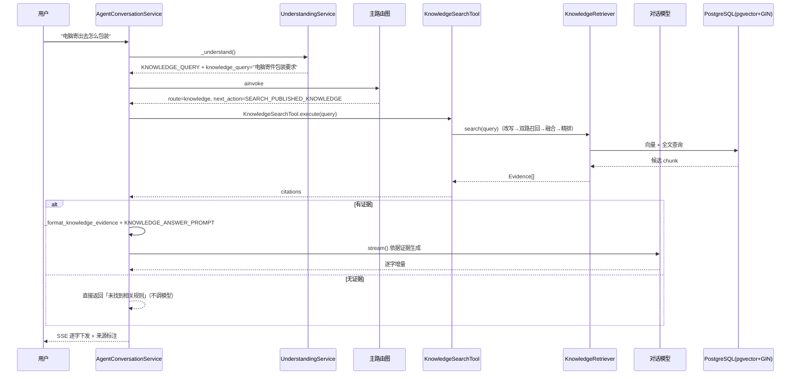

## 关键架构决策总结

| 维度 | 决策 | 位置 |
|---|---|---|
| 编排 | LangGraph 双层图：主图纯确定性路由，草稿子图才跑模型 | `graph.py` / `draft_loop.py` |
| 意图理解 | Fast Path 正则(0.99) → Slow Path LLM(≥0.6) → 降级追问 | `understanding.py` |
| HITL | 自研一次性授权令牌（5 分钟/版本绑定/SHA-256/行锁/幂等），不用 `interrupt()` | `grants.py` |
| 模型接入 | `ModelAdapter` Protocol，固定/生产两实现，结构化输出 FC→JSON 降级 | `model_adapter.py` |
| 记忆 | 短期(消息) + 工作(checkpointer) + 长期(偏好) + 语义(向量) | `models.py` / `memory.py` |
| RAG 摄入 | MinerU 异步解析 → Markdown 结构化分块 → Qwen 1024 维 + jieba 双路索引 | `tasks.py` / `chunking.py` / `indexing.py` |
| RAG 检索 | 关键词(0.55)+向量(0.45) 加权融合 → 可选 LLM 精排 | `retrieval.py` |
| 解耦 | knowledge 定义接口，agent 提供 AI 实现（改写/精排） | `rag_enhancements.py` |
| 安全 | 两道正则拦截 + 脱敏 + 预算限制 + 无证据不作答 | `nodes.py` / `privacy.py` |
| 流式 | 普通 `model.stream()`；草稿子图 `asyncio.Queue` 桥接 | `service.py` |
| 无外部组件 | 无 MCP、无 GraphRAG、无 Elasticsearch，全靠 PostgreSQL 内置能力 | — |
