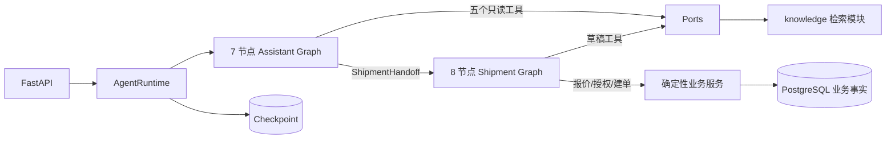

# Agent 与 RAG 架构

当前 AI 助手由 LangGraph 直接拥有控制流，`service.py` 只保留会话 CRUD 和 Runtime 兼容门面。这不是 LangChain Deep Agents，而是面向物流领域的分层 LangGraph Agent。



## 十五个节点

主图：`load_context_node`、`security_gate_node`、`assistant_agent_node`、`assistant_tools_node`、`shipment_workflow_node`、`finalize_turn_node`、`handle_failure_node`。

寄件子图：`load_draft_node`、`draft_agent_node`、`draft_tools_node`、`validate_draft_node`、`create_quote_node`、`request_confirmation_node`、`create_confirmed_shipment_node`、`shipment_failure_node`。

两个受限 ReAct 循环是：

```text
assistant_agent_node <-> assistant_tools_node
draft_agent_node     <-> draft_tools_node
```

根 Agent 可自主调用知识检索、本人运单、地址簿、当前身份和运费规则。寄件 Agent 只能检查或更新草稿、保存本次地址。报价、授权和建单不是模型工具。

## State、Checkpoint 与 HITL

根图和子图使用独立 `AssistantState` / `ShipmentState`，通过 `ShipmentHandoff` / `ShipmentWorkflowResult` 交换最小数据。Checkpoint 只保存工作流位置和 JSON 快照；草稿、报价、授权、运单以 PostgreSQL 业务表为准。

版本化报价生成后，`request_confirmation_node` 调用 LangGraph `interrupt()`。下一请求用 `Command(resume=...)` 恢复：确认进入建单，取消结束，无关消息先以 `defer` 结束等待再进入新根回合。`AgentActionGrant` 继续负责版本绑定、一次性消费、行锁和防重放，它与 interrupt 解决不同问题。

## RAG 边界

离线摄入、解析、分块、向量化和在线混合检索仍在 `yitu/knowledge`。`assistant_tools_node` 通过 `KnowledgePort` 获取已发布证据，再回到 `assistant_agent_node` 生成 grounded answer。知识检索是 Agent 工具，不额外占用一个图节点。

## 依赖和兼容

节点依赖通过 `AgentRuntimeContext` 注入，ORM、Session、模型客户端和身份对象不进入 State。模型参数不能提供身份、会话或授权字段。REST 路径与 SSE `user_message/delta/done/error` 契约保持不变。
