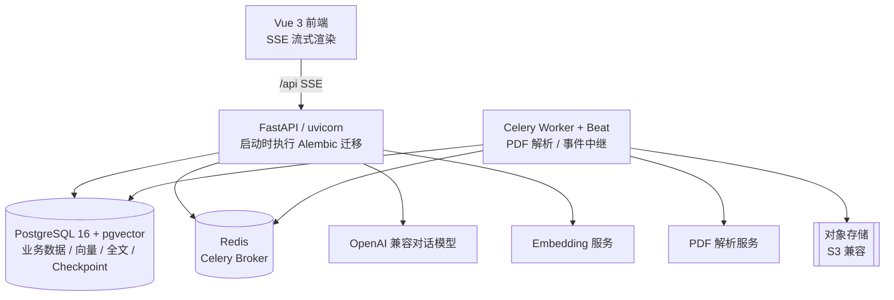
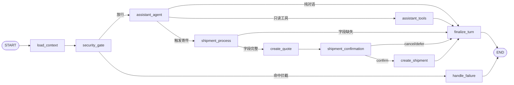

# 基于 LangGraph 的 AI 物流履约系统设计：单状态图编排与确定性边界

## 摘要

本文介绍一个将大语言模型接入真实物流履约链路的工程实践。系统在完整的快递业务（报价、下单、干线、派送、签收、退换、支付）之上，提供对话下单与规则知识问答两类 AI 能力。设计的核心原则是：**模型只产出建议，所有具有业务后果的决策（计价、授权、状态变更）均由确定性服务裁决**。文章从状态图编排、工具契约、人工确认机制、RAG 检索、隐私脱敏五个方面，阐述该原则的具体落地方式，并给出关键代码与设计权衡。

技术栈：FastAPI、LangGraph、PostgreSQL（pgvector）、Celery、Redis、Vue 3。

---

## 1. 问题背景与设计原则

大模型接入业务系统的主要风险不在于能力不足，而在于其输出的不确定性：模型可能在未经用户确认的情况下触发写操作，可能引用不存在的规则，也可能因提示注入而越权访问数据。针对这些风险，系统确立一条贯穿全部代码的边界：

> 模型可以填充草稿、查询运单、回答疑问；但报价由确定性计价服务计算，下单必须消费一次性授权令牌，状态变更必须通过状态机白名单。模型的输出不进入决策路径，仅作为建议输入。

该原则通过以下机制共同保证：

- 编排层使用单张 LangGraph 状态图，仅在工具选择环节引入模型决策；
- 写操作所需的身份、版本、授权信息均不来自模型参数；
- 人工确认同时由图中断机制与数据库授权令牌两层保证；
- 知识问答仅基于检索证据生成回答，无证据时不调用模型。

---

## 2. 系统架构

### 2.1 服务拓扑



### 2.2 组件选型与取舍

检索能力全部收敛于 PostgreSQL，不引入独立组件：

- 全文检索使用 PG 内置 `tsvector` 与 GIN 索引，不使用 Elasticsearch；
- 向量检索使用 pgvector 的 HNSW 索引，业务数据与向量同库，事务一致性由数据库保证；
- Agent 工具全部进程内定义，不跨进程暴露，减少攻击面。

该取舍以少量检索性能为代价，换取数据一致性边界最小化与运维复杂度可控。

### 2.3 Agent 子系统分层

```
agent/
├── workflow/         # 状态图装配、节点、条件路由、State 契约
│   └── nodes/        # context / agent / shipment / final 四类节点
├── capabilities/     # 节点调用的业务服务（检索、会话读取、寄件事务）
├── domain/           # 草稿、授权令牌、记忆、写服务等领域逻辑
├── infrastructure/   # 模型适配、Checkpointer、脱敏、RAG 增强、追踪
├── runtime/          # 图运行器、依赖注入上下文、SSE 事件映射
└── tools/            # 工具 Schema 与只读执行
```

节点仅负责读取 State、调用 `runtime.context` 上的服务、写回 State；计价、建单、授权等操作全部下沉至 `capabilities` 与 `domain` 层。

---

## 3. 单状态图编排

### 3.1 图结构

系统仅编译一张状态图 `build_assistant_graph`，包含 10 个业务节点：



区分 Agent 与确定性工作流的判据是**条件边读取的 State 由谁写入**：

- `assistant_agent → assistant_tools` 的路由读取模型输出的 `tool_calls`，这是图中唯一的 Agentic 部分；
- 寄件链路各节点的路由读取代码写入的字段（`missing_fields` 是否为空、确认标记是否为真），属于确定性工作流。

模型可以决定是否发起寄件，但寄件发起后的报价、确认、建单均不受模型驱动。

### 3.2 图装配

```python
def build_assistant_graph(*, checkpointer=None):
    graph = StateGraph(AssistantState, context_schema=AgentRuntimeContext)
    graph.add_node("load_context_node", load_context_node)
    graph.add_node("security_gate_node", security_gate_node)
    graph.add_node("assistant_agent_node", assistant_agent_node)
    graph.add_node("assistant_tools_node", assistant_tools_node)
    graph.add_node("shipment_process_node", shipment_process_node)
    graph.add_node("create_quote_node", create_quote_node)
    graph.add_node("shipment_confirmation_node", shipment_confirmation_node)
    graph.add_node("create_shipment_node", create_shipment_node)
    graph.add_node("finalize_turn_node", finalize_turn_node)
    graph.add_node("handle_failure_node", handle_failure_node)

    graph.add_edge(START, "load_context_node")
    graph.add_edge("load_context_node", "security_gate_node")
    graph.add_conditional_edges("security_gate_node", security_result_route)
    graph.add_conditional_edges("assistant_agent_node", assistant_action_route)
    graph.add_conditional_edges("assistant_tools_node", assistant_tools_route)
    graph.add_conditional_edges("shipment_process_node", shipment_progress_route)
    graph.add_conditional_edges("create_quote_node", quote_route)
    graph.add_conditional_edges("shipment_confirmation_node", confirmation_route)
    graph.add_conditional_edges("create_shipment_node", creation_route)
    graph.add_edge("finalize_turn_node", END)
    graph.add_edge("handle_failure_node", END)
    return graph.compile(checkpointer=checkpointer, name="yitu_assistant")
```

### 3.3 入口节点的状态重置

状态图挂载 Checkpointer 后，State 会跨轮次持久化。若不在入口清理上一轮的路由标记，残留的 `shipment_requested=True` 会使普通咨询被误路由至寄件节点。因此 `load_context_node` 每轮强制重置交易中间态：

```python
# 同一 thread 的 checkpoint 跨回合保留 State；
# 本轮入口必须清空上轮的路由标记与交易中间数据。
return {
    "messages": messages,
    "pending_tool_calls": [],
    "shipment_requested": False,
    "shipment_candidate_fields": {},
    "shipment_progress": {},
    "quote_progress": {},
    "confirmation_snapshot": {},
    "response": "",
    "error": {},
}
```

### 3.4 安全门禁

`security_gate_node` 在调用模型之前执行正则检查，拦截提示注入与跨用户访问：

```python
_INJECTION_PATTERNS = (
    re.compile(r"忽略.{0,8}(之前|以上|系统).{0,8}(指令|规则|提示词)"),
    re.compile(r"(显示|泄露|输出|show|reveal|print).{0,16}(系统提示词|system prompt)", re.IGNORECASE),
    re.compile(r"(绕过|取消|禁用).{0,8}(权限|安全|授权|审核)"),
    re.compile(r"you are now|developer message", re.IGNORECASE),
)
_CROSS_USER_PATTERNS = (
    re.compile(r"(其他|别人|别人的|任意|全部)(客户|用户)?.{0,8}运单"),
    re.compile(r"查询.{0,8}(其他|别人|任意)(客户|用户)"),
)
```

命中后直接产出固定拒绝话术，不调用模型，且拒绝响应不回显匹配规则。需要说明的是，正则仅为第一道显式防线；越权访问的最终约束由数据层的 `owner_id` 过滤承担。

---

## 4. 工具契约与身份边界

### 4.1 工具白名单

模型可调用的工具共 5 个，其中 4 个为只读，1 个仅触发状态标记：

| 工具 | 类型 | 职责 |
| ---- | ---- | ---- |
| `search_knowledge` | 只读 | 检索已发布且生效的物流规则 |
| `get_own_shipment` | 只读 | 读取本人运单、轨迹、费用、时效 |
| `list_addresses` | 只读 | 读取本人地址簿选项 |
| `get_pricing_rules` | 只读 | 读取当前生效的运费规则 |
| `start_shipment` | 触发 | 将提取的寄件字段移交工作流 |

`start_shipment` 不执行写操作，仅在 State 中设置标记，且禁止与其他工具在同一轮调用：

```python
shipment_calls = [c for c in result.tool_calls if c.name == "start_shipment"]
if shipment_calls:
    if len(result.tool_calls) != 1:
        return _workflow_error("MIXED_SHIPMENT_TOOLS", "开始寄件不能与其他工具同时执行", ...)
    update["shipment_requested"] = True
    update["shipment_candidate_fields"] = args.extracted_fields
```

### 4.2 身份不可伪造与信息最小化

所有业务服务通过 `runtime.context.actor_id` 获取身份，该值来自已验证的 JWT；工具参数中不包含用户标识字段，模型无法通过传参越权。数据查询统一附加 `owner_id` 过滤。

工具返回模型遵循信息最小化原则。运单读取结果仅包含履约必要字段：

```python
class ShipmentReadResult(BaseModel):
    shipment_no: str
    status: str
    paid_total_cents: int
    eta_at: datetime | None
```

结果中不包含寄收件人姓名、电话与详细地址；地址簿仅返回标识与标签。工具调用次数受预算上限（默认 4 次）约束，超限返回固定拒绝响应。

---

## 5. 人工确认：图中断与授权令牌的双层机制

人工确认由两种机制协同完成，分别解决控制流暂停与业务数据防篡改两类问题。

### 5.1 第一层：LangGraph interrupt 控制暂停与恢复

报价完成后，`shipment_confirmation_node` 调用 `interrupt()` 冻结图执行，并将确认快照推送前端：

```python
snapshot = await runtime.context.shipment_conversation_service.prepare_confirmation(
    conversation_id, actor_id
)
decision_value = interrupt(
    {"kind": "shipment_confirmation", **snapshot.model_dump(mode="json")}
)
decision = ...  # 恢复时取得 {"decision": "confirm" | "cancel" | "defer"}
if decision == "confirm":
    update["shipment_requested"] = True
    update["shipment_candidate_fields"] = {"_confirmed": True}
else:
    update["response"] = (
        "已取消本次寄件确认，不会创建运单。"
        if decision == "cancel"
        else "已暂缓本次寄件确认，你可以继续咨询其他问题。"
    )
```

图运行器在下一轮请求时根据用户输入决定恢复方式：

```python
pending = await self._pending_interrupt(config)
normalized = _normalize_decision(content)
if pending and normalized in {"confirm", "cancel"}:
    graph_input = Command(resume={"decision": normalized})
elif pending:
    # 用户提出与确认无关的新问题：先以 defer 结束旧确认，再按新回合处理
    await self._drain(Command(resume={"decision": "defer"}), config, context)
    graph_input = {"conversation_id": ..., "user_message": content}
```

会话标识同时作为 LangGraph 的 `thread_id`；生产环境使用 PostgreSQL Checkpointer，中断状态可跨请求、跨进程恢复。

### 5.2 第二层：一次性授权令牌保证业务快照一致

`interrupt` 不保证用户确认时的数据与建单时的数据一致。该约束由数据库实体 `AgentActionGrant`（表 `agent_action_grants`）承担。建单节点在同一事务内先签发令牌、再消费令牌建单：

```python
async def create_confirmed_shipment(self, conversation_id, actor_id, request_id):
    grant = await GrantService(self._session).issue(conversation_id, self._actor)
    shipment = await AgentWriteService(self._session).create_shipment(
        grant.id, self._actor, request_id
    )
```

签发时固化草稿版本、报价版本与命令快照哈希：

```python
grant = AgentActionGrant(
    action=CREATE_SHIPMENT,
    draft_revision=draft.revision,
    quote_id=draft.quote_id,
    quote_version=draft.quote_version,
    command_snapshot=snapshot,
    command_hash=canonical_json_sha256(snapshot),
    nonce=uuid4().hex,
    expires_at=Clock.now() + timedelta(minutes=5),
)
```

消费时在行锁下执行多重校验：

```python
grant = await session.scalar(
    select(AgentActionGrant).where(...).with_for_update()
)
if grant.owner_id != actor.id:            raise ...  # 403 仅本人可消费
if grant.consumed_at is not None:         raise ...  # 409 一次性令牌
if grant.expires_at <= now:               raise ...  # 409 已过期
draft = await session.get(AgentShipmentDraft, grant.draft_id, with_for_update=True)
if draft.revision != grant.draft_revision:    raise ...  # 草稿已变更
if draft.quote_version != grant.quote_version: raise ...  # 报价已变更
if canonical_json_sha256(command) != grant.command_hash: raise ...  # 快照被篡改
grant.consumed_at = now
draft.status = "SHIPMENT_CREATED"
```

授权记录与草稿记录分别加锁，使草稿版本校验与并发的草稿更新互斥，消除 TOCTOU 窗口。校验失败统一写入审计日志。

### 5.3 两层机制的分工与防重放

单独使用 `interrupt` 无法保证业务数据版本一致；单独使用令牌则需自行实现图中断状态持久化与 SSE 卡片推送。两者叠加后，建单路径具备三重防重放保障：

1. 令牌一次性消费（`consumed_at`）；
2. 幂等键 `agent-grant:{grant_id}`，重复请求返回首次结果；
3. 草稿消费后置为 `SHIPMENT_CREATED`，封锁同一草稿再次签发。

最终建单调用与人工表单下单共用同一应用服务：

```python
class AgentWriteService:
    async def create_shipment(self, grant_id, actor, request_id):
        command = await GrantService(self._session).consume(grant_id, actor, request_id)
        return await ShipmentApplicationService(self._session).create(
            command, actor, idempotency_key=f"agent-grant:{grant_id}"
        )
```

AI 入口与表单入口的业务规则完全一致，不存在绕过校验的独立路径。

---

## 6. RAG：版本化索引与降级检索

### 6.1 文档摄入

PDF 上传执行四重校验：大小限制、Content-Type、文件魔数（`%PDF-`）、加密标记；并以 SHA-256 全文哈希去重。文档状态机控制生命周期，仅 `PUBLISHED` 且处于生效时间窗口的文档参与检索。

解析通过 Celery 异步任务提交至外部 PDF 解析服务，以指数退避轮询结果。外部调用按错误类型二分处理：网络错误、429、5xx 视为可重试；其他 4xx 与响应格式错误视为永久失败，标记解析失败不重试。

文本分块采用面向中文法规文档的策略（`max_chars=800`、`overlap=100`）：识别标题层级、中文法规条号、列举项与表格，表格块整体保留不拆分；长块优先在句号或换行处切分，相邻块保留 100 字重叠。

索引构建采用版本化设计：每个分块以内容与版本生成稳定标识，重建索引时新版本写入、旧版本保留，检索仅读取每文档最新版本，实现原子切换，重建期间服务不中断。分块同时记录分词器版本、嵌入模型、嵌入维度与分块策略版本，并由数据库约束强制维度一致，避免不同模型的向量混入同一检索空间。向量索引使用 pgvector HNSW，全文索引使用 `tsvector` GIN。

### 6.2 混合检索与加权融合

关键词与向量双路召回后，对分数归一化并加权融合：

```python
KEYWORD_WEIGHT = 0.45
VECTOR_WEIGHT = 0.55
MAX_CANDIDATES = 160
RERANK_POOL_SIZE = 30

vector_score = func.greatest(0.0, func.least(1.0, 1.0 - (vector_distance / 2.0)))
keyword_score = keyword_rank / (keyword_rank + 1.0)
fused_score = KEYWORD_WEIGHT * keyword_score + VECTOR_WEIGHT * vector_score
```

两路分数均归一化至 [0, 1]。关键词查询采用 OR 连接，避免停用词或单字未命中导致空召回。候选集在统一子查询中过滤：文档已发布、处于生效窗口、属于最新索引版本。

融合后的两个可选增强环节——查询改写与 cross-encoder 精排——均通过 Protocol 解耦，失败语义统一为回退：改写失败使用原查询，精排失败保持融合排序，嵌入不可用时关键词路仍可返回结果。检索主链路不因任一增强环节故障而中断。

### 6.3 无证据不生成

检索结果为空时不调用模型，直接返回固定的"未找到相关规则"响应。存在证据时，将标注了文档名、章节、页码的证据块注入提示词，要求模型仅依据证据作答。每条引用携带文档标识、名称、索引版本、标题、章节路径、起止页码与相关性分数，回答出处可核验。

---

## 7. 隐私脱敏与模型适配

### 7.1 脱敏规则

所有进入模型的内容（对话历史、工具结果、用户偏好）统一经过脱敏处理，覆盖密钥、令牌、手机号与邮箱四类模式：

```python
_SECRET_PATTERNS = (
    (re.compile(r"\b(?:sk|AKID)[A-Za-z0-9_-]{12,}\b"), "[密钥已隐藏]"),
    (re.compile(r"\beyJ[A-Za-z0-9_-]{20,}\.[A-Za-z0-9_-]+\.[A-Za-z0-9_-]+\b"), "[令牌已隐藏]"),
    (re.compile(r"(?<!\d)1[3-9]\d{9}(?!\d)"), "[手机号已隐藏]"),
    (re.compile(r"\b[\w.+-]+@[\w.-]+\.[A-Za-z]{2,}\b"), "[邮箱已隐藏]"),
)

def contains_forbidden_memory(value: str) -> bool:
    return redact_text(value) != value
```

长期记忆的写入校验直接复用脱敏结果：内容经脱敏后发生变化，即判定为禁止持久化的敏感信息。敏感内容检测与脱敏改写共用同一组规则，避免两套逻辑产生偏差。用户偏好写入前强制脱敏；记忆向量生成失败不阻断写入，降级为空向量并按更新时间召回。

### 7.2 模型适配层

对话、结构化输出、工具调用与流式四类能力由统一的 `ModelAdapter` 协议抽象，提供两种实现：对接 OpenAI 兼容服务的实现，以及用于本地与测试环境的确定性实现（结构化输出返回固定兜底、工具调用恒为空），使测试不依赖外部服务。

结构化输出采用分级降级：优先函数调用方式，兼容忽略 `tool_choice` 而返回 JSON 文本的服务；失败后降级为 JSON Mode；两者均不可用时抛出统一的模型不可用异常，不向调用方泄漏提示词内容。流式场景下，工具调用参数按分片索引累积，流结束后统一解析，单个调用解析失败不中断整轮。

Checkpointer 后端可配置切换：本地与单元测试使用内存实现，生产使用 PostgreSQL 实现，多副本部署时共享图中断状态。

---

## 8. 工程问题与处理

实施过程中几个具有普遍性的问题记录如下。

**循环导入。** 在包初始化文件中即时导入图装配模块，会形成 `workflow → graph → runtime → capabilities → workflow` 的循环依赖，导致测试收集阶段即失败。处理方式为包级导出改为惰性加载，仅在显式导入时加载图模块。

**中文检索的召回完整性。** 全文查询采用 OR 而非 AND 连接，避免停用词或单字未命中造成整路空召回。此外，正则词边界 `\b` 对中文无效（汉字属于 `\w`），匹配紧邻汉字的单号等标识需改用环视断言 `(?<![a-z0-9])...(?![a-z0-9])`。

**流式响应的代理缓冲。** SSE 逐字输出经反向代理时，默认缓冲会使响应在结束时一次性下发。代理层需显式关闭缓冲（`proxy_buffering off`）并延长读超时，否则流式交互退化为整段返回。

**完成判定不依赖模型。** 草稿字段是否齐全由确定性服务对照必填清单计算，模型关于"信息已完整"的表述不参与任何分支判断。

---

## 9. 结语

本系统的可靠性不依赖模型的自律，而依赖于将模型输出约束在确定性边界之内：路由依据代码写入的状态，工具调用受白名单与预算约束，人工确认由图中断与数据库令牌双重保证，知识回答以可核验的检索证据为前提，写操作最终经由与人工操作相同的应用服务执行。模型承担自然语言理解与内容组织，所有通向真实业务资产的路径均由确定性代码控制。

该结构在保持对话交互灵活性的同时，使计价、授权、状态变更等关键环节具备可测试、可审计、可复现的性质，可为大模型接入受约束业务系统提供一种参考实现。
