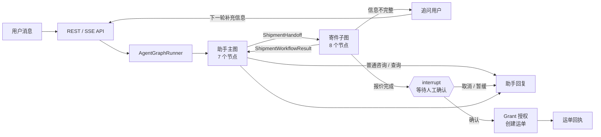
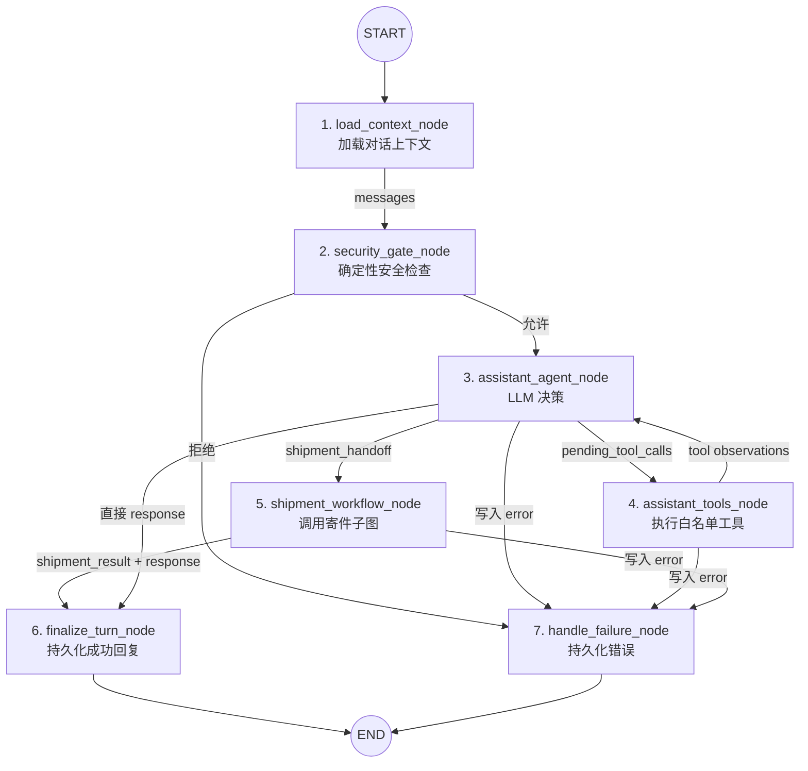
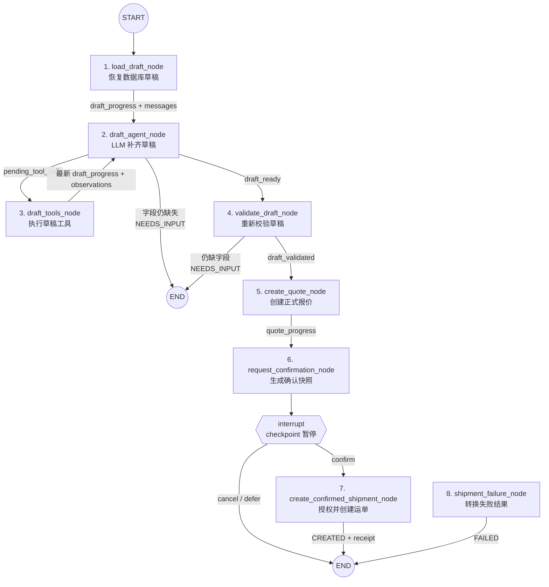

# Yitu LangGraph 三层流程图

这份图按面试讲解顺序拆成三层：先看业务全貌，再展开助手主图，最后展开寄件子图。图中只保留主数据流；每个节点的具体行为放在图后的说明表里。

## 图一：系统全貌



### 全局数据如何流转

1. API 把 `conversation_id` 和 `user_message` 交给 `AgentGraphRunner`。
2. Runtime 使用 `conversation_id` 作为 LangGraph `thread_id`，并注入当前用户、数据库 Session、模型和各类 Port。
3. 主图使用 `AssistantState` 处理通用问答和工具调用。
4. 需要寄件时，主图只通过 `ShipmentHandoff` 把用户原话和候选字段交给子图。
5. 子图使用独立的 `ShipmentState` 处理草稿、报价和确认。
6. 子图通过 `ShipmentWorkflowResult` 把 `NEEDS_INPUT`、`CREATED`、`CANCELLED`、`FAILED` 等结果交回主图。
7. `interrupt()` 产生的暂停位置和 State 由 checkpointer 保存；草稿、报价和运单仍以 PostgreSQL 业务表为事实源。

---

## 图二：助手主图（7 个节点）



### 主图核心数据链

```text
conversation_id + user_message
  -> messages
  -> pending_tool_calls
  -> tool observations
  -> response

寄件分支：
messages
  -> shipment_handoff
  -> ShipmentState
  -> shipment_result
  -> response
```

### 主图节点明细

#### 1. `load_context_node`

- **读取 State**：`conversation_id`、`user_message`。
- **具体动作**：根据当前登录用户加载最近 20 条会话消息，规范化 `role`、`content`、`tool_calls` 和 `tool_call_id`；必要时追加本轮用户消息。
- **调用对象**：`ConversationPort.load_history`。
- **LLM / Tool / RAG / MCP**：均不调用。
- **写回 State**：`messages`、`turn_count=0`、`tool_call_count=0`。
- **下一节点**：`security_gate_node`。

#### 2. `security_gate_node`

- **读取 State**：`user_message`。
- **具体动作**：用确定性正则检查提示词注入、系统提示词泄露、权限绕过和跨用户运单访问。
- **调用对象**：无外部服务。
- **LLM / Tool / RAG / MCP**：均不调用。
- **写回 State**：安全通过时不写业务字段；拒绝时写入结构化 `WorkflowError`。
- **下一节点**：通过进入 `assistant_agent_node`；拒绝进入 `handle_failure_node`。

#### 3. `assistant_agent_node`

- **读取 State**：`messages`、`user_message`、`turn_count`。
- **提示词组装**：`SYSTEM_PROMPT + messages`。其中 `messages` 既包含历史对话，也包含工具节点返回的 observation。
- **具体动作**：调用支持 Function Calling 的模型，由模型决定直接回答、调用只读工具，还是通过 `start_shipment` 交接寄件任务。
- **可见工具**：`search_knowledge`、`get_own_shipment`、`list_addresses`、`get_current_identity`、`get_pricing_rules`、`start_shipment`。
- **流式输出**：模型 token 通过 LangGraph `stream_writer` 交给 Runtime，再映射成 SSE token 事件。
- **RAG**：本节点不直接检索；模型选择 `search_knowledge` 后由工具节点触发 RAG。
- **MCP**：不调用，所有工具都是本地 Python Tool / Port。
- **写回 State**：追加 assistant message，并写入 `pending_tool_calls`、`shipment_handoff` 或 `response` 三者之一，同时增加 `turn_count`。
- **下一节点**：工具调用进入 `assistant_tools_node`；寄件进入 `shipment_workflow_node`；直接回答进入 `finalize_turn_node`；错误进入失败节点。

#### 4. `assistant_tools_node`

- **读取 State**：`pending_tool_calls`、`messages`、`tool_call_count`。
- **安全校验**：`AssistantToolCall` 只允许固定工具名，并拒绝模型参数中的 `actor_id`、`user_id`、`conversation_id`、`grant_id` 和 `request_id`。
- **具体动作**：逐个执行模型选择的白名单只读工具。
- **调用对象**：知识查询走 `KnowledgePort`；运单、地址、身份和计价规则走 `AssistantReadPort`。
- **RAG**：只有 `search_knowledge` 会进入混合检索流程。
- **LLM / MCP**：本节点不调用 LLM，也不调用 MCP。
- **写回 State**：把每个 `AssistantToolObservation` 作为 `role=tool` 消息追加到 `messages`，清空 `pending_tool_calls`，增加 `tool_call_count`。
- **下一节点**：回到 `assistant_agent_node`，由模型读取 observation 后继续决策。

#### 5. `shipment_workflow_node`

- **读取 State**：`conversation_id`、`shipment_handoff`。
- **具体动作**：构造最小 `ShipmentState`，调用已经编译的寄件子图；子图结束后校验 `ShipmentWorkflowResult`。
- **调用对象**：寄件 LangGraph 子图。
- **LLM / Tool / RAG / MCP**：本节点均不直接调用。
- **写回 State**：`shipment_result` 和 `response`；子图未返回合法结果时写入 `WorkflowError`。
- **下一节点**：成功进入 `finalize_turn_node`；交接失败进入 `handle_failure_node`。

#### 6. `finalize_turn_node`

- **读取 State**：`conversation_id`、`response`。
- **具体动作**：为无内容响应设置稳定兜底话术，把最终助手消息和 trace 摘要写入会话表。
- **调用对象**：`ConversationPort.append_message`。
- **LLM / Tool / RAG / MCP**：均不调用。
- **写回 State**：最终 `response`。
- **下一节点**：`END`。

#### 7. `handle_failure_node`

- **读取 State**：`conversation_id`、`error`。
- **具体动作**：校验 `WorkflowError`，持久化稳定的用户可见错误、结构化错误详情和 trace。
- **调用对象**：`ConversationPort.append_message`。
- **LLM / Tool / RAG / MCP**：均不调用。
- **写回 State**：错误话术作为 `response`。
- **下一节点**：`END`。

> 主图异常有两条路径：节点主动写入 `WorkflowError` 时进入 `handle_failure_node`；节点直接抛出的未捕获异常会越过图内失败节点，由最外层 `AgentGraphRunner` 统一映射为 `AGENT_RUNTIME_ERROR` SSE 事件。

### 主图工具返回的数据

| 工具 | 数据来源 | 返回给 Agent 的核心数据 |
|---|---|---|
| `search_knowledge` | PostgreSQL FTS + pgvector | 文档、章节、页码、正文、相关分数 |
| `get_own_shipment` | 运单业务服务 | 当前用户有权读取的运单、轨迹、费用和时效 |
| `list_addresses` | 地址业务服务 | 当前用户的最小化地址选项 |
| `get_current_identity` | 已鉴权 Runtime context | 当前登录身份摘要 |
| `get_pricing_rules` | 正式计价服务 | 当前生效的确定性计价规则 |
| `start_shipment` | 模型生成 handoff | 用户原话和模型提取的候选寄件字段 |

---

## 图三：寄件子图（8 个节点）



> 错误流统一规则：带条件路由的节点在写入 `WorkflowError` 后进入 `shipment_failure_node`。为了保证主流程可读，图中不再从每个节点分别画错误连线。当前 `load_draft_node` 直接连接 `draft_agent_node`；如果它抛出未捕获异常，会由最外层 `AgentGraphRunner` 处理，而不会进入子图失败节点。

### 子图核心数据链

```text
ShipmentHandoff
  -> draft_progress
  -> pending_tool_calls
  -> 更新后的 draft_progress
  -> draft_validated
  -> quote_progress
  -> confirmation_snapshot
  -> confirmation_decision
  -> ShipmentWorkflowResult
```

### 子图节点明细

#### 1. `load_draft_node`

- **读取 State**：`conversation_id`、`handoff`、可能已有的 `messages`。
- **具体动作**：从数据库获取或创建当前会话的寄件草稿，并读取草稿状态、revision、快照和缺失字段；首次进入时把 handoff 中的用户原话和候选字段加入消息。
- **调用对象**：`ShipmentWorkflowPort.load_progress`，Adapter 内部调用 `DraftService.get_or_create` 和 `DraftService.view`。
- **LLM / RAG / MCP**：均不调用。
- **写回 State**：`draft_progress`、`messages`、预算计数。
- **下一节点**：`draft_agent_node`。

#### 2. `draft_agent_node`

- **读取 State**：`draft_progress`、`messages`、`turn_count`。
- **提示词组装**：把草稿已填快照、缺失字段和地址使用规则填入 `DRAFT_LOOP_PROMPT`，再追加子图消息。
- **具体动作**：调用模型判断哪些明确字段可以写入、是否需要保存新地址，或者还需要追问用户什么信息。
- **可见工具**：`inspect_draft`、`update_draft`、`save_address`。
- **RAG / MCP**：均不调用。
- **写回 State**：有工具调用时写 `pending_tool_calls`；仍缺字段且无工具调用时写 `ShipmentWorkflowResult(status=NEEDS_INPUT)`；字段齐全时写 `draft_ready=True`；同时增加 `turn_count`。
- **下一节点**：工具调用进入 `draft_tools_node`；需要用户输入则结束本轮子图；字段齐全进入 `validate_draft_node`。

#### 3. `draft_tools_node`

- **读取 State**：`conversation_id`、`pending_tool_calls`、`draft_progress`、`messages`、`tool_call_count`。
- **安全校验**：`DraftToolCall` 限制固定工具名，并拒绝模型提供可信身份字段。
- **具体动作**：`inspect_draft` 读取草稿；`update_draft` 更新用户已明确提供的字段；`save_address` 保存临时或常用地址并回填草稿。
- **关键措施**：每执行一个工具后都重新加载数据库草稿，防止模型继续使用陈旧状态。
- **调用对象**：`ShipmentWorkflowPort.execute_draft_tool`，内部调用草稿和地址业务服务。
- **LLM / RAG / MCP**：均不调用。
- **写回 State**：最新 `draft_progress`、工具 observation、清空后的 `pending_tool_calls` 和累计工具次数。
- **下一节点**：回到 `draft_agent_node`。

#### 4. `validate_draft_node`

- **读取 State**：`conversation_id`。
- **具体动作**：重新从数据库加载草稿，确定模型判断“字段齐全”之后，草稿是否仍然完整且未发生不一致。
- **调用对象**：`ShipmentWorkflowPort.load_progress`。
- **LLM / RAG / MCP**：均不调用。
- **写回 State**：完整时写 `draft_validated=True`；不完整时写 `ShipmentWorkflowResult(status=NEEDS_INPUT)` 和最新 `draft_progress`。
- **下一节点**：校验通过进入 `create_quote_node`；否则结束本轮子图。

#### 5. `create_quote_node`

- **读取 State**：`conversation_id`。
- **具体动作**：再次执行正式草稿校验，并由正式计价服务生成报价快照。
- **调用对象**：`ShipmentWorkflowPort.validate_and_quote`，内部调用 `DraftService.validate_and_quote`。
- **LLM / RAG / MCP**：均不调用，金额不是由模型生成。
- **写回 State**：`quote_progress`，包含 `quote_id`、`quote_version`、`draft_revision`、`total_cents` 和可选过期时间。
- **下一节点**：`request_confirmation_node`。

#### 6. `request_confirmation_node`

- **读取 State**：`conversation_id`，并通过业务服务重新读取草稿和报价。
- **具体动作**：构造 `ConfirmationSnapshot`，然后调用 LangGraph `interrupt()` 暂停工作流。
- **interrupt 数据**：草稿 revision、报价 ID、报价版本、金额和寄件摘要。
- **恢复方式**：Runtime 检查 pending interrupt，并把固定确认词转换为 `Command(resume={decision})`。
- **LLM / RAG / MCP**：均不调用，用户授权不交给模型判断。
- **写回 State**：`confirmation_snapshot`、`confirmation_decision`；取消时写 `CANCELLED`，暂缓时写 `AWAITING_CONFIRMATION`。
- **下一节点**：`confirm` 进入创建节点；`cancel` 或 `defer` 结束子图。

#### 7. `create_confirmed_shipment_node`

- **读取 State**：`conversation_id`；可信 `actor_id` 和 `request_id` 来自 Runtime context。
- **具体动作**：通过一个深层 Port 方法完成授权签发、授权消费和运单创建。
- **授权保护**：Grant 绑定 owner、动作、草稿 revision、报价版本、命令快照 hash、nonce 和 5 分钟有效期；消费时使用行锁、一次性消费和幂等键。
- **调用对象**：`ShipmentWorkflowPort.create_confirmed`；内部使用 `GrantService`、`AgentWriteService` 和统一 `ShipmentApplicationService.create`。
- **LLM / RAG / MCP**：均不调用。
- **写回 State**：`ShipmentWorkflowResult(status=CREATED)`，其中包含运单号、运单 ID 和金额回执。
- **下一节点**：`END`。

#### 8. `shipment_failure_node`

- **读取 State**：`error`。
- **具体动作**：把任一上游节点产生的 `WorkflowError` 转换为稳定的子图返回契约。
- **调用对象**：仅记录 trace，不调用业务写服务。
- **LLM / Tool / RAG / MCP**：均不调用。
- **写回 State**：`ShipmentWorkflowResult(status=FAILED, response, error)`。
- **下一节点**：`END`，再由主图校验并持久化回复。

### 子图工具的数据变化

| 工具 | 输入 | 数据库动作 | 返回子图的数据 |
|---|---|---|---|
| `inspect_draft` | 空参数 | 不修改，只读取当前草稿 | status、revision、missing_fields、snapshot |
| `update_draft` | 用户明确提供的寄件字段 | 更新草稿并递增 revision | 最新 `DraftProgress` |
| `save_address` | 姓名、电话、地区、详细地址等 | 保存地址并把地址引用回填草稿 | 最新 `DraftProgress` |

## State、Runtime 与 checkpoint 的边界

- `AssistantState` 和 `ShipmentState` 只保存可序列化的工作流快照。
- `AgentRuntimeContext` 注入 `actor_id`、`request_id`、模型和 Port；这些可信依赖不进入 State，也不能由模型参数提供。
- 生产 checkpointer 使用 `AsyncPostgresSaver`，本地和测试可使用 `MemorySaver`。
- `thread_id` 使用 `conversation_id`；子图沿用父图传播的 context 和 checkpoint namespace。
- checkpoint 保存节点位置、State 和 interrupt；草稿、报价、消息、授权和运单保存在各自业务表中。

## 面试时的简短讲法

> 整个 LangGraph 一共 15 个节点。用户请求先进入 7 节点主图，主 Agent 在受限 ReAct 循环中选择只读工具；需要寄件时，通过 `ShipmentHandoff` 进入独立的 8 节点寄件子图。子图用第二个 ReAct 循环补齐数据库草稿，再经过确定性校验、正式报价和 `interrupt()` 人工确认；确认后通过一次性 Grant 调用统一建单服务。两个图使用独立 State，通过稳定 DTO 交换最小数据，checkpoint 只负责恢复流程，PostgreSQL 业务表才是事实源。
