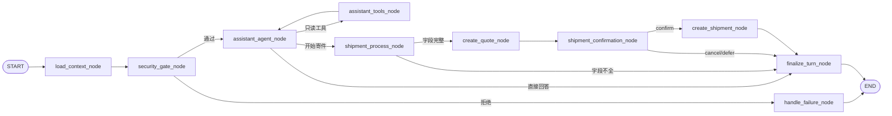

# 单图 LangGraph 流程

当前实现只有一张已编译的助手图。`conversation_id` 同时作为业务会话 ID 和 LangGraph `thread_id`；每条新消息从 `START` 进入本图，checkpoint 仅用于恢复人工确认中断。

## 节点职责与数据

| 节点 | 读取 | 调用 | 写入 State / 数据库 | 下一步 |
|---|---|---|---|---|
| `load_context_node` | 会话 ID、本轮消息 | `ConversationMessageService.load_history` | 标准化 `messages`、预算计数 | 安全检查 |
| `security_gate_node` | 本轮消息 | 本地规则 | `error`（命中时） | Agent 或失败收口 |
| `assistant_agent_node` | 对话消息、工具观察 | 模型 `stream_with_tools` | `response`、`pending_tool_calls` 或寄件候选字段 | 工具、寄件或收口 |
| `assistant_tools_node` | 待执行工具 | 知识检索或本人只读查询 | `role=tool` 观察消息 | 返回 Agent，构成唯一 ReAct 循环 |
| `shipment_process_node` | 候选字段、会话 ID | `ShipmentConversationService.apply_user_message` | 数据库草稿与 `shipment_progress` | 缺字段收口，完整则报价 |
| `create_quote_node` | 草稿 | `create_quote` | 业务报价与 `quote_progress` | 确认 |
| `shipment_confirmation_node` | 草稿、报价 | `prepare_confirmation`、`interrupt()` | `confirmation_snapshot` | 暂停，恢复后建单/取消 |
| `create_shipment_node` | 已恢复的确认决定 | `create_confirmed_shipment` | Grant、运单与回执 | 收口 |
| `finalize_turn_node` | `response` | 会话消息服务 | 持久化助手回复 | END |
| `handle_failure_node` | `error` | 会话消息服务 | 持久化稳定错误回复 | END |

## 两类循环

只有 `assistant_agent_node <-> assistant_tools_node` 是 ReAct 循环：模型选择白名单只读工具，工具结果以 `role=tool` 加回消息，再由模型决定是否继续工具调用或生成答复。寄件不是子图，也没有第二个 Agent 循环；它是连续的确定性事务节点。字段缺失时，`shipment_process_node` 读取数据库草稿并生成追问，本轮结束，用户补充后下一条消息重新从主图入口运行。

## HITL 与事实源

`shipment_confirmation_node` 调用 `interrupt()` 暂停图。Runner 发现中断后把确认卡片持久化并发送既有 SSE `done` 事件。用户发送固定确认/取消词时，Runner 传入 `Command(resume={"decision": ...})` 恢复同一 thread。恢复建单前，业务服务重新从 PostgreSQL 读取草稿、报价、授权和幂等事实；checkpoint 不充当交易事实。
