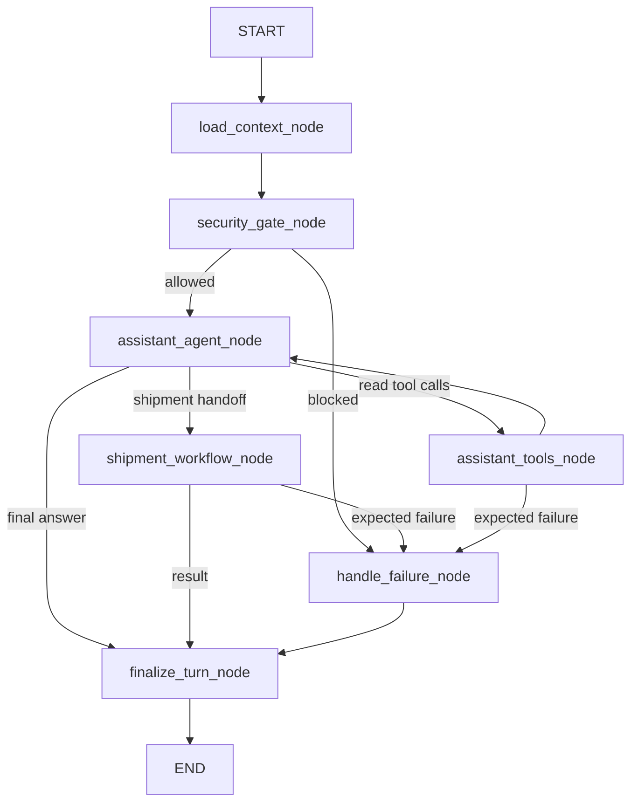
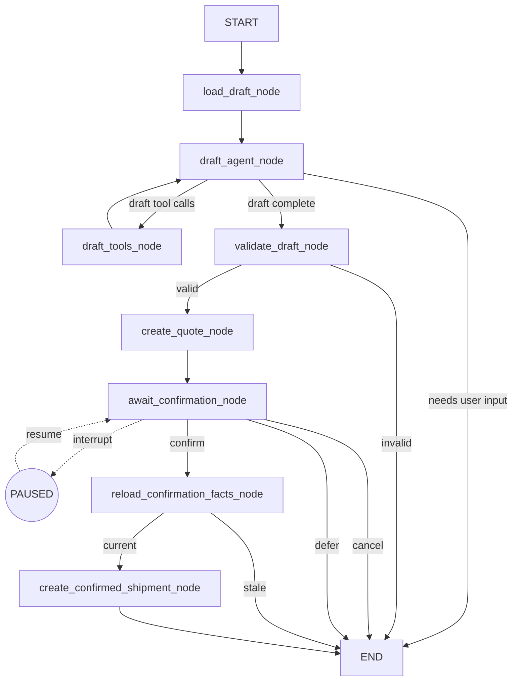

# LangGraph Agent 重构设计

**日期：** 2026-08-24
**状态：** 待实施
**目标：** 将当前以 `AgentConversationService._run_turn()` 为真实编排器、LangGraph 仅负责浅路由的实现，重构为由 LangGraph 拥有控制流、工具循环、持久化状态和 HITL 的分层 Agent 架构，同时保持现有前端 REST/SSE 契约兼容。

## 1. 背景与问题

当前项目已经安装并调用 LangGraph，但框架没有真正拥有工作流：

- `UnderstandingService` 在图外完成意图识别和槽位提取；
- 主图只把预先计算的意图映射成 `route` 和 `next_action`；
- RAG、只读工具、模型回复、草稿、报价、授权和建单均由 `service.py` 中的 `if/elif` 分支执行；
- 草稿子图虽配置 checkpointer，但每轮执行前调用 `_clear_thread()`，无法形成真正的跨请求恢复；
- `service.py` 已超过一千行，集中了会话、模型、工具、SSE、草稿和交易流程；
- 仓库缺少已提交的 pytest 行为保护网，现有固定评测仍绑定旧浅路由接口。

删除当前主图后，核心复杂度不会扩散，调用链反而更短。这说明主图是浅模块，真实编排模块是 `AgentConversationService._run_turn()`。

本次重构不是把 `if/elif` 机械搬进节点，而是将 LangGraph 建成 Agent 应用流程运行时。

## 2. 设计目标

### 2.1 必须实现

- LangGraph 主图拥有一次助手请求的完整控制流；
- 通用助手具备受限 ReAct 循环，可以自主选择只读工具、观察结果并继续推理；
- 对话寄件子图具备独立的草稿工具循环；
- 报价确认使用 LangGraph `interrupt()` / `Command(resume=...)`；
- PostgreSQL checkpointer 支持应用重启后的中断恢复；
- 业务数据库继续裁决草稿、报价、授权、运单和审计事实；
- 当前 REST、非流式响应和四类 SSE 事件保持兼容；
- 删除 `service.py` 中陈旧的路由、工具、模型和寄件编排；
- 节点、条件边、Port、DTO 和 State 的命名一眼可辨；
- 建立节点、图、恢复、API 契约和业务安全测试。

### 2.2 不在范围内

- 不实现项目当前不存在的物流异常处置 Agent；
- 不引入多 Agent supervisor、todo、文件系统规划或通用 subagent handoff；
- 不将报价、权限、授权或建单裁决交给模型；
- 不为展示框架而引入无业务价值的 time travel 或任意写工具；
- 不修改前端消息接口和 SSE 联合类型；
- 不将现有业务模块整体重写为 LangGraph 节点。

## 3. 架构定位

重构后的准确名称是：

> 分层 LangGraph Agent：顶层是受限 ReAct 助手 Agent，寄件流程是带草稿工具循环、持久化 checkpoint 和 HITL 的领域子图，交易阶段由确定性业务节点接管。

该架构是真正的 Agentic Workflow，但不是 LangChain “Deep Agents” 架构。项目没有长期任务规划、文件系统上下文、多 subagent 协作等需求，强行套用 Deep Agents 会增加无价值的复杂度。

职责分工：

```text
LLM               理解语言、选择允许的工具、生成工具参数和自然语言回复
LangGraph         控制流程、循环、分支、暂停、恢复、预算和执行轨迹
确定性业务模块     裁决权限、草稿、报价、授权、幂等和建单
PostgreSQL        保存业务事实和事务结果
LangGraph saver   保存图状态、执行位置和 interrupt
```

## 4. 总体架构



`AgentConversationService` 不再决定下一步动作，只作为现有接口的兼容门面：

```python
class AgentConversationService:
    async def send_message(...) -> AgentTurnView:
        return await self.runtime.invoke_message(...)

    async def stream_message(...) -> AsyncIterator[PublicAgentEvent]:
        async for event in self.runtime.stream_message(...):
            yield event
```

## 5. 主图设计

主图包含 7 个节点。

| 节点 | 职责 |
|---|---|
| `load_context_node` | 持久化用户消息，加载受限历史、记忆和最小身份上下文 |
| `security_gate_node` | 执行注入、越权、确认状态、超时和预算守卫 |
| `assistant_agent_node` | 模型理解用户消息，自主选择允许的工具、进入寄件子图或生成最终回答 |
| `assistant_tools_node` | 执行注册的只读工具，将结果作为 tool message 返回 Agent |
| `shipment_workflow_node` | 通过最小 handoff 调用编译后的寄件子图 |
| `handle_failure_node` | 处理可预期工作流失败，生成安全响应并记录 trace |
| `finalize_turn_node` | 保存助手消息、envelope、trace 和最终会话状态 |

### 5.1 通用助手 ReAct 循环

```text
assistant_agent_node
        ↓ tool_calls
assistant_tools_node
        ↓ tool results
assistant_agent_node
```

允许模型自主选择的只读能力：

- `search_knowledge`；
- `query_own_shipment`；
- `query_addresses`；
- `query_identity`；
- `query_pricing_rules`。

这些能力是独立、可测试的工具，但共享一个 `assistant_tools_node` 执行节点。它们的编排语义相同，没有必要扩张成五个图节点。

模型禁止直接调用：

- 草稿持久化之外的写操作；
- 报价裁决；
- 授权签发或消费；
- 运单创建；
- 任何跨用户查询。

循环退出条件：

- 模型产生最终回答；
- 模型产生结构化寄件 handoff；
- 达到最大推理轮次、工具调用次数或超时；
- 发生安全拒绝或可预期失败。

### 5.2 取消顶层 UnderstandingService

取消独立 `UnderstandingService` 作为图外意图分类器和路由器的职责，避免重复模型调用：

```text
旧：UnderstandingService → 意图枚举 → 浅图路由 → service.py 执行
新：assistant_agent_node → tool call / handoff / final answer
```

可复用能力按职责迁移：

| 现有能力 | 新位置 |
|---|---|
| 文本规范化 | `load_context_node` 调用的纯函数 |
| 提示词注入与越权检查 | `security_gate_node` |
| 意图枚举和路由映射 | 删除 |
| 顶层 LLM 结构化意图调用 | 删除 |
| 运单号提取 | 工具参数模型或纯函数 |
| 知识查询改写 | 知识工具内部 |
| 草稿候选字段模型 | `ShipmentHandoff` 和草稿工具参数 |
| 低置信度追问 | `assistant_agent_node` |
| 明确确认或取消识别 | Runtime 确定性恢复判断 |

## 6. 寄件子图设计

寄件子图包含 8 个节点。



| 节点 | 职责 |
|---|---|
| `load_draft_node` | 通过 Port 从业务数据库加载当前草稿进度 |
| `draft_agent_node` | 判断更新字段、保存地址、检查草稿或向用户追问 |
| `draft_tools_node` | 执行受限草稿工具并返回观察结果 |
| `validate_draft_node` | 调用确定性业务规则校验草稿 |
| `create_quote_node` | 调用确定性计价模块生成版本化报价 |
| `await_confirmation_node` | 保存确认摘要并通过 `interrupt()` 等待用户决定 |
| `reload_confirmation_facts_node` | 恢复后重新加载并核对草稿、报价、用户和授权事实 |
| `create_confirmed_shipment_node` | 在一个业务事务中签发/消费授权并创建运单 |

### 6.1 草稿工具循环

```text
draft_agent_node
       ↓ tool_calls
draft_tools_node
       ↓ tool results
draft_agent_node
```

只允许以下工具：

- `inspect_draft`；
- `update_draft`；
- `save_address`。

草稿 Agent 不能调用 RAG、任意运单查询、报价、授权或建单工具。字段完整后必须退出自主循环，进入确定性交易节点。

### 6.2 HITL 使用范围

只在字段校验完成并生成报价后使用 `interrupt()`。缺字段追问不使用 interrupt，原因是统一助手允许用户在寄件过程中临时询问知识、运单或计价问题；每条非确认消息应重新进入主图，由主 Agent 判断继续寄件还是处理其他任务。

确认恢复规则：

```text
存在 WAITING_CONFIRMATION checkpoint
  ├─ 明确确认 → Command(resume={"decision": "confirm"})
  ├─ 明确取消 → Command(resume={"decision": "cancel"})
  └─ 其他消息 → Command(resume={"decision": "defer"}) 关闭当前等待
               → 再把原消息作为主图的新输入
```

同一 `thread_id` 上不能绕过未解决的 interrupt 直接开始另一轮。`defer` 只关闭工作流等待，不伪造确认或取消业务事实。用户之后重新进入寄件流程时，子图重新加载数据库：草稿和报价仍有效则重新展示确认摘要并建立新 interrupt；已失效则重新校验和报价。

如果插入消息修改草稿，旧 grant、旧报价确认和旧恢复上下文必须失效，重新报价后才能产生新的确认点。

`interrupt()` 只表示用户选择，不替代业务授权。恢复后仍必须重新检查：

- 草稿 revision；
- 报价 ID 和规则版本；
- 当前用户；
- grant 状态、有效期和 nonce；
- 命令快照 hash；
- 幂等键和并发锁。

## 7. 主图与子图的接口

主图和寄件子图使用两个独立 State，不共享一个大而混杂的 `AgentState`。

### 7.1 AssistantState

```python
class AssistantState(TypedDict, total=False):
    conversation_id: str
    actor_id: str
    trace_id: str
    messages: Annotated[list[dict[str, object]], add]
    tool_call_count: int
    turn_count: int
    active_workflow: Literal["assistant", "shipment"]
    shipment_handoff: dict[str, object] | None
    shipment_result: dict[str, object] | None
    response: str
    error: dict[str, object] | None
```

### 7.2 ShipmentState

```python
class ShipmentState(TypedDict, total=False):
    conversation_id: str
    actor_id: str
    trace_id: str
    request: dict[str, object]
    draft_revision_seen: int | None
    quote_id_seen: str | None
    quote_version_seen: str | None
    missing_fields: list[str]
    messages: Annotated[list[dict[str, object]], add]
    workflow_status: ShipmentWorkflowStatus
    confirmation_decision: Literal["confirm", "cancel", "defer"] | None
    receipt: dict[str, object] | None
    error: dict[str, object] | None
```

具体实现中，跨 checkpoint 的值使用可序列化 dict；在节点接口处用 Pydantic DTO 校验。

### 7.3 最小 Handoff

主图只向子图传递：

```python
class ShipmentHandoff(BaseModel):
    user_message: str
    extracted_fields: DraftCandidate
```

子图只向主图返回：

```python
class ShipmentWorkflowResult(BaseModel):
    status: Literal[
        "NEEDS_INPUT",
        "WAITING_CONFIRMATION",
        "DEFERRED",
        "CREATED",
        "CANCELLED",
        "FAILED",
    ]
    response: str
    shipment_id: UUID | None = None
```

不跨图共享完整工具历史、ORM 对象、数据库会话、模型客户端、完整业务草稿或可执行授权对象。

正式实现必须使用 LangGraph 支持嵌套持久化和 interrupt 传播的子图组合方式。禁止在普通节点中创建一个脱离父图 thread 的独立子图调用。

## 8. State 与 Checkpoint

State 是工作流数据契约；checkpoint 是 LangGraph 对 State 和执行位置的持久化快照；checkpointer 是读写快照的存储适配器。

主图和子图共享同一个 PostgreSQL checkpointer 和 `thread_id = conversation_id`。LangGraph 通过 checkpoint namespace 区分父图和子图：

```text
conversation thread
├── assistant graph checkpoint / AssistantState
└── shipment subgraph checkpoint / ShipmentState
```

checkpoint 保存：

- 可序列化 State；
- 已完成和待执行节点；
- reducer 结果；
- interrupt 和待恢复任务；
- 父子图执行位置；
- retry/task 元数据。

checkpoint 不保存：

- ORM 对象和 `AsyncSession`；
- `CurrentUser`、模型客户端和流式队列；
- 完整电话、门牌等非必要敏感数据；
- 可直接执行的授权对象；
- 被当作最终事实的报价金额或创建命令。

删除 `_clear_thread()`。会话删除时统一删除该 thread 的父子图 checkpoints。

checkpoint 中的 `draft_revision_seen` 和 `quote_version_seen` 只表示工作流上次观察到的版本。恢复后必须重新从业务数据库读取并比较，数据库始终是业务事实源。

## 9. 节点接口与依赖注入

节点统一接收可序列化 State 和运行时上下文，并只返回状态增量或 `Command`：

```python
async def example_node(
    state: AssistantState,
    runtime: Runtime[AgentRuntimeContext],
    writer: StreamWriter,
) -> dict[str, object] | Command:
    ...
```

节点约束：

- 不能直接调用另一个节点；
- 不能自行创建数据库会话或模型客户端；
- 不能把运行时依赖写进 State；
- 不能自行跨多个业务模块管理事务；
- 只能返回本节点负责的状态增量；
- 复杂业务规则必须隐藏在深 Port 后面。

### 9.1 Runtime Context

```python
@dataclass(frozen=True, slots=True)
class AgentRuntimeContext:
    actor_id: UUID
    actor_role: str
    request_id: str
    conversations: ConversationPort
    model: ModelPort
    knowledge: KnowledgePort
    assistant_reads: AssistantReadPort
    shipment_workflow: ShipmentWorkflowPort
    tracing: TracePort
```

取消顶层 `UnderstandingService` 不代表取消结构化模型输出；`assistant_agent_node` 和 `draft_agent_node` 通过同一个 `ModelPort` 调用模型。

### 9.2 深 Port

只为生产与测试确实需要替换的外部依赖建立 seam：

- `ConversationPort`；
- `ModelPort`；
- `KnowledgePort`；
- `AssistantReadPort`；
- `ShipmentWorkflowPort`；
- `TracePort`。

`AssistantReadPort` 集中提供本人运单、地址、身份和计价规则的受控查询，生产适配器复用现有只读工具，测试适配器返回内存 DTO。知识检索因包含 RAG 证据与降级规则，保留独立 `KnowledgePort`。

不为每个现有类机械添加 Protocol。`ShipmentWorkflowPort` 隐藏草稿、报价、grant 和建单组合复杂度：

```python
class ShipmentWorkflowPort(Protocol):
    async def load_progress(...) -> DraftProgress: ...
    async def apply_candidate(...) -> DraftProgress: ...
    async def validate_and_quote(...) -> QuoteProgress: ...
    async def prepare_confirmation(...) -> ConfirmationSnapshot: ...
    async def create_confirmed(...) -> ShipmentReceipt: ...
```

生产适配器内部复用现有 `DraftService`、计价模块、`GrantService` 和 `ShipmentApplicationService`。图测试使用内存适配器。

`create_confirmed()` 必须在一个数据库事务中完成：

```text
锁定 grant 和 draft
→ 重新校验草稿与报价版本
→ 校验快照 hash、nonce 和幂等
→ 消费授权
→ 创建运单
→ 写审计和回执事实
```

节点不能逐步调用这些模块并自行提交。

## 10. 编译与运行时

两张图在应用生命周期中装配并编译一次，不在每条消息中重新构建：

```python
shipment_graph = build_shipment_graph()
assistant_graph = build_assistant_graph(shipment_graph)
compiled_graph = assistant_graph.compile(checkpointer=checkpointer)
```

每次请求只传入图输入、运行上下文和 thread 配置：

```python
compiled_graph.astream(
    graph_input,
    context=runtime_context,
    config={"configurable": {"thread_id": str(conversation_id)}},
    stream_mode=["custom", "updates"],
)
```

`AgentRuntime` 负责：

- 验证会话归属；
- 决定普通输入还是确定性 resume；
- 调用已编译图；
- 将内部事件映射为公开事件；
- 收集非流式结果；
- 捕获非预期异常并执行安全兜底。

它不能包含 `route == ...` 业务分支。

## 11. Knowledge RAG 的模块归属与调用

知识库继续作为独立深模块保留在 `yitu/knowledge`，不迁入 Agent 节点目录，也不反向依赖 `yitu/agent`。

`knowledge` 模块继续负责：

- 文档上传、解析、切片、向量化和索引；
- 审核、发布和生命周期管理；
- 已发布内容过滤；
- 向量召回、中文全文召回和混合排序；
- 结构化引用与无结果判断。

LangGraph 负责决定何时检索、观察检索结果以及是否继续调用工具或生成回答：

```text
assistant_agent_node
→ search_knowledge tool call
→ assistant_tools_node
→ KnowledgePort
→ ProductionKnowledgeAdapter
→ yitu/knowledge retrieval
→ KnowledgeEvidence tool message
→ assistant_agent_node
→ grounded answer
```

最终自然语言回答由 `assistant_agent_node` 根据结构化证据生成，不在 `knowledge/service.py` 内生成，避免知识模块和 Agent 重复调用模型。

`KnowledgePort` 只暴露小接口：

```python
class KnowledgePort(Protocol):
    async def search(
        self,
        query: KnowledgeSearchInput,
        *,
        actor_id: UUID,
    ) -> KnowledgeEvidence: ...
```

`KnowledgeEvidence` 至少包含 `found` 和结构化 `citations`。无已发布证据时返回 `found=False`，主 Agent 必须明确拒绝凭模型自身知识回答物流规则。

确定性查询清洗、混合检索和基础排序属于 `knowledge`。如保留 LLM 查询改写或精排，它们作为 `KnowledgePort` 生产适配器内部的可选策略，通过 `ModelPort` 注入；主图不感知 BM25、pgvector、RRF 或精排实现细节。

RAG 仍由现有 `assistant_tools_node` 执行，不增加 LangGraph 节点，总节点数保持 15 个。

## 12. REST 与 SSE 兼容

以下接口保持不变：

- `POST /api/v1/agent/conversations/{id}/messages`；
- `POST /api/v1/agent/conversations/{id}/messages/stream`；
- 草稿、校验报价、grant 和 grant 消费接口；
- 会话和消息查询接口。

非流式接口继续返回：

```python
class AgentTurnView(BaseModel):
    user_message: MessageView
    assistant_message: MessageView
```

前端公开 SSE 事件保持四类：

| 内部工作流事件 | 公开 SSE | Payload |
|---|---|---|
| 用户消息已保存 | `user_message` | 完整 `AgentMessage` |
| 模型 token | `delta` | `{"content": "..."}` |
| 助手消息已保存 | `done` | 完整 `AgentMessage` |
| Runtime 公开错误 | `error` | `{"code": "...", "message": "..."}` |

内部可以产生 `NodeCompleted`、`ToolCompleted`、`WorkflowInterrupted` 等事件，由 `AgentSSEEventMapper` 选择性映射，不修改当前前端联合类型。

报价确认文案仍作为普通回复发送：

```text
delta: 预计运费与确认提示
done: 完整助手消息
内部状态: WAITING_CONFIRMATION
```

前端不需要理解 `interrupt` 事件。

## 13. 失败、重试与事务

保留显式 `handle_failure_node`，采用两级失败处理。

### 13.1 可预期失败

节点将业务或受控基础设施失败转换为：

```python
class WorkflowError(BaseModel):
    code: str
    message: str
    retryable: bool = False
    source_node: str
```

条件边将错误状态送入 `handle_failure_node`。适用场景包括：

- 草稿字段不合法；
- 报价或草稿版本失效；
- grant 过期、已消费或不属于当前用户；
- 工具确定性拒绝；
- 模型/RAG 可识别的暂时不可用；
- 达到工具、轮次或时间预算。

`handle_failure_node` 设置工作流状态、生成安全用户文案、记录 trace，并交给 `finalize_turn_node`。

### 13.2 非预期异常

程序错误、连接突然中断和未知 SDK 异常由 `AgentRuntime` 捕获。Runtime 必须回滚未提交事务、记录内部 trace，并仅向用户返回稳定错误协议；不能将堆栈、SQL、提示词或敏感上下文写入公开响应。

## 14. 命名、注释与可读性

命名规则：

| 类型 | 规则 | 示例 |
|---|---|---|
| 节点函数 | `*_node` | `assistant_agent_node` |
| 条件边函数 | `*_route` | `draft_progress_route` |
| 图构建函数 | `build_*_graph` | `build_shipment_graph` |
| Port | `*Port` | `ShipmentWorkflowPort` |
| 生产适配器 | `*Adapter` | `SqlShipmentWorkflowAdapter` |
| 输入 DTO | `*Input` / `*Handoff` | `ShipmentHandoff` |
| 输出 DTO | `*Result` / `*Receipt` | `ShipmentWorkflowResult` |
| 状态 | `*State` | `AssistantState` |
| 工作流错误 | `*WorkflowError` | `WorkflowError` |

普通业务函数禁止使用 `_node` 后缀。

注释和 docstring 使用简体中文，解释：

- 确定性边界存在的原因；
- 恢复后重新读取业务事实的原因；
- 模型不能调用某类工具的安全不变量；
- checkpoint 与业务数据库的不同职责；
- 事务、权限、幂等和并发约束。

不逐行翻译显而易见的代码。节点建议保持在 20–50 行；超过后优先将业务复杂度收进深 Port，而不是继续添加浅节点。

建议目录：

```text
agent/
├── runtime/
│   ├── runtime.py
│   ├── context.py
│   └── event_mapper.py
├── workflows/
│   ├── assistant_graph.py
│   └── shipment_graph.py
├── state/
│   ├── assistant_state.py
│   └── shipment_state.py
├── nodes/
│   ├── context_nodes.py
│   ├── assistant_nodes.py
│   ├── shipment_nodes.py
│   └── finalize_nodes.py
├── ports/
│   ├── conversation.py
│   ├── model.py
│   ├── knowledge.py
│   ├── assistant_reads.py
│   ├── shipment_workflow.py
│   └── tracing.py
├── tools/
└── service.py
```

## 15. 测试策略

### 15.1 行为基线与 API 契约

实施重构前先补测试并让旧架构通过：

- 非流式 `AgentTurnView`；
- SSE `user_message → delta* → done`；
- SSE 失败事件；
- 普通问答、知识查询、个人查询和寄件确认；
- 授权、报价版本、并发确认和越权保护。

### 15.2 节点测试

使用内存 Port 直接测试节点的 State 增量、Port 参数、错误转换和敏感数据保护。测试面通过节点接口，不越过 interface 验证实现细节。

### 15.3 图级测试

使用 `MemorySaver` 和固定模型运行完整主图与子图，覆盖：

- 直接回答；
- 一次和多次只读工具调用；
- RAG 有证据和无证据；
- 工具预算终止；
- 寄件 handoff；
- 多轮草稿补全；
- 报价后 interrupt；
- `Command(resume=confirm/cancel/defer)`；
- 非确认消息通过 `defer` 关闭等待后重新进入主图；
- defer 后重新进入寄件流程会建立新的确认点；
- 草稿修改后重新报价；
- 完成后重复确认不重复建单；
- 显式失败节点。

### 15.4 PostgreSQL 恢复测试

使用真实 `AsyncPostgresSaver`：

1. 父图进入寄件子图；
2. 子图在确认节点 interrupt；
3. 销毁第一个 runtime；
4. 使用同一 `thread_id` 创建新 runtime；
5. `Command(resume=confirm)`；
6. 验证从子图中断点继续；
7. 验证父图收到结果并 finalize；
8. 验证只创建一票运单。

### 15.5 业务安全测试

必须覆盖：

- 跨用户会话和运单查询；
- 模型伪造 `user_id/address_id/quote_id`；
- 草稿 revision 或报价版本变化；
- grant 缺失、过期、重复消费；
- 两个并发确认请求；
- checkpoint 可恢复但数据库事实已变化；
- 模型或 RAG 暂时不可用；
- 应用重启后的恢复。

## 16. 评测重建

旧评测只调用浅路由图，不能证明真实 Agent 行为。重构为：

```text
evals/
├── deterministic/
│   ├── security.yaml
│   ├── workflow.yaml
│   └── authorization.yaml
└── model/
    ├── tool_selection.yaml
    ├── draft_extraction.yaml
    └── rag_grounding.yaml
```

确定性评测运行完整工作流和固定适配器；在线模型评测记录模型、配置、时间、样本和通过率。简历和面试中的所有指标必须能由仓库命令重新生成。

## 17. 迁移顺序

### 阶段一：行为基线

- 添加现有 REST/SSE 契约测试；
- 添加授权、版本和并发安全测试；
- 记录旧架构的正常行为；
- 不修改生产代码。

### 阶段二：深 Port

- 建立 `ConversationPort`、`ModelPort`、`KnowledgePort`、`AssistantReadPort`、`ShipmentWorkflowPort` 和 `TracePort`；
- 用生产适配器包装现有模块；
- 为每个 Port 提供测试适配器。

### 阶段三：State、DTO 与节点

- 新增 `AssistantState`、`ShipmentState`；
- 新增 `ShipmentHandoff`、`ShipmentWorkflowResult` 和 `WorkflowError`；
- 实现带 `_node` 后缀的 15 个节点；
- 实现两个受限 ReAct 循环。

### 阶段四：两张图

- 装配 `assistant_graph` 和 `shipment_graph`；
- 将寄件子图作为主图深模块；
- 只在报价确认点使用 interrupt；
- 使用 `MemorySaver` 完成图级验证。

### 阶段五：持久化恢复

- 接入现有 `AsyncPostgresSaver`；
- 删除 `_clear_thread()`；
- 实现父子图 checkpoint 生命周期；
- 验证重启、并发和陈旧事实恢复。

### 阶段六：Runtime 与 SSE

- `AgentRuntime` 接管 invoke、stream 和 resume；
- `AgentSSEEventMapper` 保持四类公开事件；
- 非流式与流式入口复用同一张图；
- `AgentConversationService` 降级为兼容门面。

### 阶段七：删除陈旧编排

- 删除旧浅路由 `graph.py` 和动作标记节点；
- 删除旧 `draft_loop.py`；
- 删除独立顶层 `UnderstandingService` 及意图映射；
- 删除图外模型回复、工具执行、报价、确认降级和建单流程；
- 更新文档、评测和面试稿，使其与代码一致。

不要长期保留 legacy/new 双执行路径。每个迁移阶段通过测试后直接替换旧路径，Git 提供回滚能力。

## 18. 旧编排删除门禁

重构完成后，`service.py` 不允许包含：

- `build_agent_graph`；
- `build_draft_loop_graph`；
- `route ==` 或按 route 分发的等价逻辑；
- `KnowledgeSearchTool`、`ShipmentReadTool`、`PricingRuleTool` 等执行调用；
- `model.stream`、`model.stream_with_tools`；
- `_clear_thread`；
- `_stream_draft_loop`；
- `_auto_quote_if_complete`；
- `_confirm_shipment`；
- 图外 confirmation 降级为 draft 的分支。

静态检查至少包含：

```powershell
rg "build_draft_loop_graph|_clear_thread|route ==|model\.stream" backend/src/yitu/agent/service.py
```

结果必须为空。删除的文件和符号不能继续被文档、测试、评测或入口引用。

## 19. 提交策略

建议按以下小提交推进：

```text
test(agent): 固化现有接口与安全行为
refactor(agent): 建立工作流端口
feat(agent): 新增类型化工作流状态与节点
feat(agent): 新增助手主图与寄件子图
feat(agent): 接入可恢复确认工作流
refactor(agent): 使用 AgentRuntime 替换旧编排
refactor(agent): 删除陈旧服务层编排
test(agent): 重建工作流评测与恢复验证
docs(agent): 更新架构与面试材料
```

每个提交独立通过对应测试，不在最终代码中维护两套工作流。

## 20. 完成标准

- 系统包含 15 个命名明确的 LangGraph 节点；
- 主图和寄件子图各包含一个受限 ReAct 工具循环；
- LangGraph 拥有工具选择、循环、子图 handoff、HITL、恢复和 finalize 控制流；
- `service.py` 仅保留兼容门面和会话 CRUD，不再拥有业务编排；
- 应用重启后可以恢复子图确认点；
- 并发确认只创建一票运单；
- 旧草稿、旧报价或重复 grant 不能恢复建单；
- checkpoint 不替代业务数据库事实；
- 现有 REST/SSE 前端契约不变；
- 节点、条件边、Port、DTO、State 和适配器命名符合规范；
- 关键注释解释安全、恢复和事务原因，不逐行翻译代码；
- 代码、测试、评测、架构文档和面试讲稿保持一致；
- 简历中关于自主工具调用、持久化恢复和 HITL 的描述均可由测试或演示复现。
